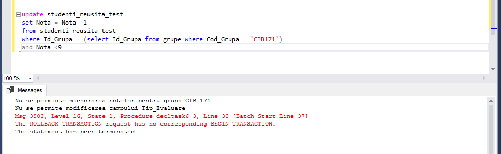

# Laboratorul Nr.10
# Crearea si utilizarea declansatoarelor

#TASK_01

Sa se modifice declansatorul inregistrare_noua,in asa fel,incat in cazul actualizarii auditoriului sa apara mesajul de informare, care, in afara de disciplina si ora, va afisa codul grupei afectate, ziua, blocul, auditoriul vechi si auditoriul nou.

```SQL
DROP TRIGGER IF EXISTS inregistrare_noua2
GO
CREATE TRIGGER inregistrare_noua2 ON plan_studii.orarul
AFTER UPDATE
AS SET NOCOUNT ON
IF UPDATE(Auditoriu)
SELECT 'Lectia la disciplina ' + UPPER(disc_St.Disciplina)+ ', a grupei ' + grupe.Cod_Grupa +
		', ziua de ' + CAST(inserted.Zi as VARCHAR(5)) + ', de la ora ' + CAST(inserted.Ora as VARCHAR(5))
		+ ', a fost transferata in aula ' + CAST(inserted.Auditoriu as VARCHAR(5)) + ', Blocul '+
		CAST(inserted.Bloc as VARCHAR(5)) + '. Auditoriul vechi: ' + CAST(deleted.Auditoriu as VARCHAR(5))+
		', Auditoriul nou: ' + CAST(inserted.Auditoriu as VARCHAR(5))
FROM inserted,deleted, disc_St, grupe
WHERE deleted.Id_Disciplina = disc_St.Id_Disciplina
AND inserted.Id_Grupa = grupe.Id_Grupa
GO

UPDATE plan_studii.orarul SET Auditoriu=510 WHERE Auditoriu = 501
```


#TASK_02

Sa se creeze declansatorul, care ar asigura popularea corecta (consecutiva) a tabelelor studenti si studenti_reusita,si ar permite evitarea erorilor la nivelul cheilor externe.

```SQL
CREATE TRIGGER declans10_2 ON reusita_St
INSTEAD OF INSERT
AS SET NOCOUNT ON
   
  INSERT INTO reusita_St 
  SELECT * FROM inserted
  WHERE Id_Student in (SELECT Id_Student FROM stud_St)
  GO

  INSERT INTO reusita_St values ((select max(Id_Student) from stud_St), 103, 104, 1, 'Examen', null, null)

 -- INSERT INTO stud_St values ((select max(Id_Student) from reusita_St)+2,'Artur', 'Croitoru', '1996-12-12', null)

 -- delete from studentiS where Id_Student = (select max(Id_Student) from stud_St)
  select * from stud_St where Id_Student= (select max(Id_Student) from stud_St)
  select * from reusita_St where Id_Student = (select max(Id_Student) from stud_St)
```


#TASK_03

 Sa se creeze un declansator, care ar interzice micsorarea notelor in tabelul studenti_reusita si modificarea valorilor campului Data_Evaluare, unde valorile acestui camp sunt nenule. Declansatorul trebuie sa se lanseze, numai daca sunt afectate datele studentilor din grupa, "CIB 171". Se va afisa un mesaj de avertizare in cazul tentativei de a incalca constrangerea.

```SQL
IF OBJECT_ID('decltask6_3', 'TR') is not null
   DROP TRIGGER decltask6_3
   GO
CREATE TRIGGER decltask6_3 ON studenti_reusita_test
AFTER UPDATE
AS
SET NOCOUNT ON
IF UPDATE (Nota)
DECLARE @ID_GRUPA INT = (SELECT Id_Grupa  
                         FROM grupe 
						 WHERE Cod_Grupa = 'CIB171')
DECLARE @count int = (SELECT count(*) 
                      FROM deleted , inserted 
			          where deleted.Id_Disciplina = inserted.Id_Disciplina 
					  and deleted.Id_Grupa = inserted.Id_Grupa 
			          and deleted.Id_Profesor = inserted.Id_Profesor 
					  and deleted.Tip_Evaluare = inserted.Tip_Evaluare 
			          and deleted.Id_Student = inserted.Id_Student
			          and inserted.Nota < deleted.Nota 
			          and inserted.Id_Grupa = @ID_GRUPA)	
BEGIN
IF (@count > 0 )
PRINT ('Nu se perminte micsorarea notelor pentru grupa CIB 171')
ROLLBACK TRANSACTION
end
IF UPDATE(Data_evaluare)
		SET @count = (SELECT count(*) 
		FROM deleted 
		WHERE Data_Evaluare is not null and Id_Grupa = @ID_GRUPA)
		IF @count > 0
		BEGIN
			PRINT ('Nu se permite modificarea campului Tip_Evaluare')
			ROLLBACK TRANSACTION
		END
GO
```

