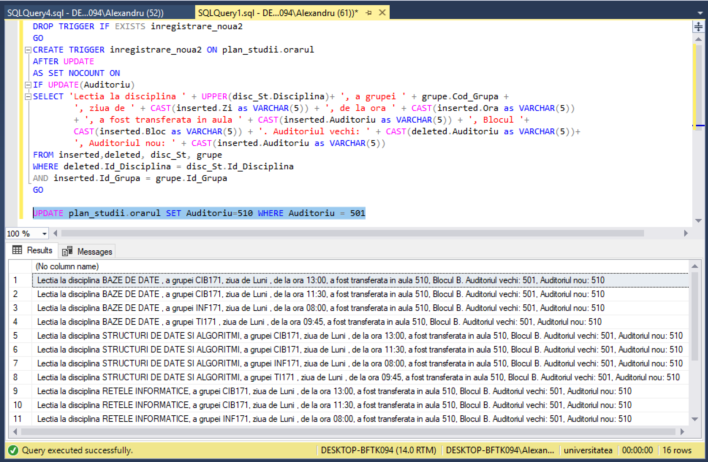

# Laboratorul Nr.10
# Crearea si utilizarea declansatoarelor

#TASK_01

Sa se modifice declansatorul inregistrare_noua,in asa fel,incat in cazul actualizarii auditoriului sa apara mesajul de informare, care, in afara de disciplina si ora, va afisa codul grupei afectate, ziua, blocul, auditoriul vechi si auditoriul nou.

```SQL
DROP TRIGGER IF EXISTS inregistrare_noua2
GO
CREATE TRIGGER inregistrare_noua2 ON plan_studii.orarul
AFTER UPDATE
AS SET NOCOUNT ON
IF UPDATE(Auditoriu)
SELECT 'Lectia la disciplina ' + UPPER(disc_St.Disciplina)+ ', a grupei ' + grupe.Cod_Grupa +
		', ziua de ' + CAST(inserted.Zi as VARCHAR(5)) + ', de la ora ' + CAST(inserted.Ora as VARCHAR(5))
		+ ', a fost transferata in aula ' + CAST(inserted.Auditoriu as VARCHAR(5)) + ', Blocul '+
		CAST(inserted.Bloc as VARCHAR(5)) + '. Auditoriul vechi: ' + CAST(deleted.Auditoriu as VARCHAR(5))+
		', Auditoriul nou: ' + CAST(inserted.Auditoriu as VARCHAR(5))
FROM inserted,deleted, disc_St, grupe
WHERE deleted.Id_Disciplina = disc_St.Id_Disciplina
AND inserted.Id_Grupa = grupe.Id_Grupa
GO

UPDATE plan_studii.orarul SET Auditoriu=510 WHERE Auditoriu = 501
```




