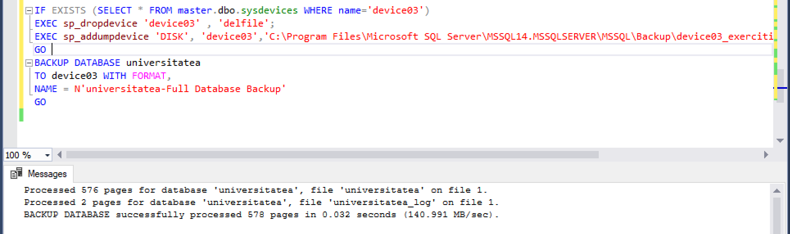
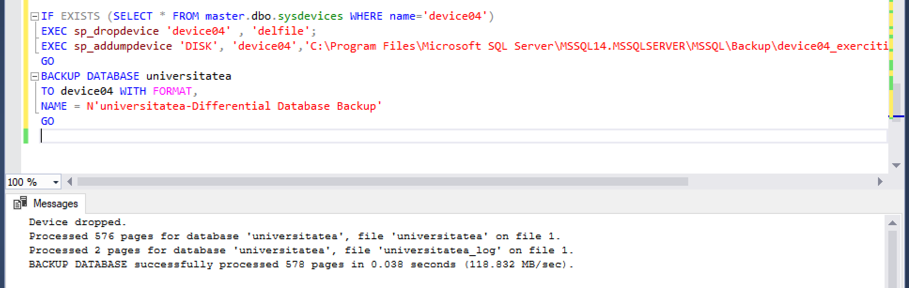

# Laboratorul Nr.10
# RECUPERAREA BAZEI DE DATE

#TASK_01

Sa se creeze un dosar Backup_lab11. Sa se execute un backup complet al bazei de date universitatea in acest dosar. 
Fisierul copiei de rezerva sa se numeasca exercitiu11.bak. Sa se scrie instructiunea SQL respectiva.

```SQL
IF EXISTS (SELECT * FROM master.dbo.sysdevices WHERE name='device03')
EXEC sp_dropdevice 'device03' , 'delfile';
EXEC sp_addumpdevice 'DISK', 'device03','C:\Program Files\Microsoft SQL Server\MSSQL14.MSSQLSERVER\MSSQL\Backup\Backup\device03_exercitiul11.bak'
GO 
BACKUP DATABASE universitatea
TO device03 WITH FORMAT,
NAME = N'universitatea-Full Database Backup'
GO
```




#TASK_02

Sa se scrie instructiunea unui backup diferentiat al bazei de date universitatea.
Fisierul copiei de rezerva sa se numeasca exercitiul2.bak.

```SQL
IF EXISTS (SELECT * FROM master.dbo.sysdevices WHERE name='device04')
EXEC sp_dropdevice 'device04' , 'delfile';
EXEC sp_addumpdevice 'DISK', 'device04','C:\Program Files\Microsoft SQL Server\MSSQL14.MSSQLSERVER\MSSQL\Backup\device04_exercitiul11.bak'
GO 
BACKUP DATABASE universitatea
TO device04 WITH FORMAT,
NAME = N'universitatea-Differential Database Backup'
GO
```

