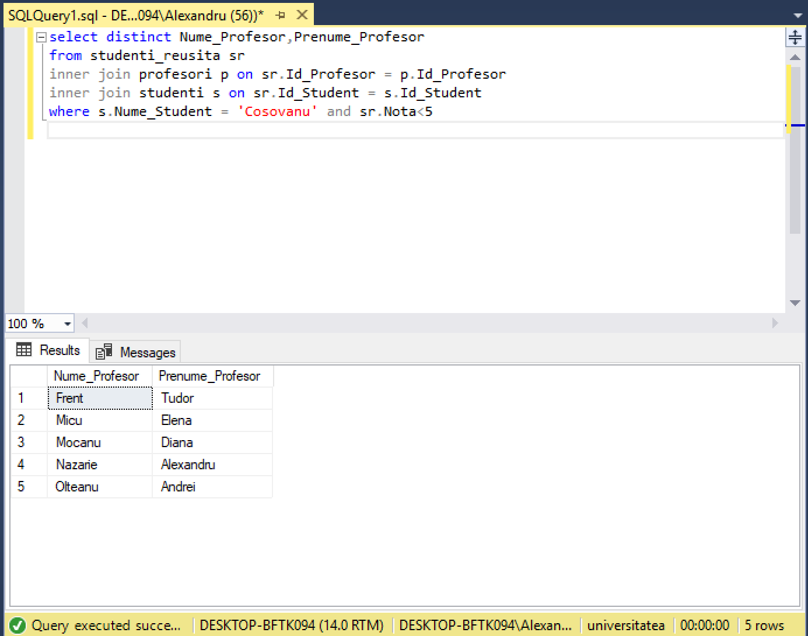
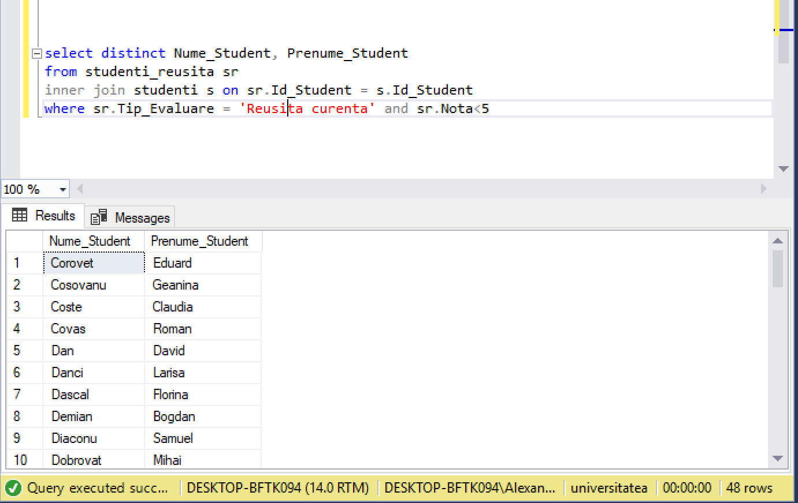
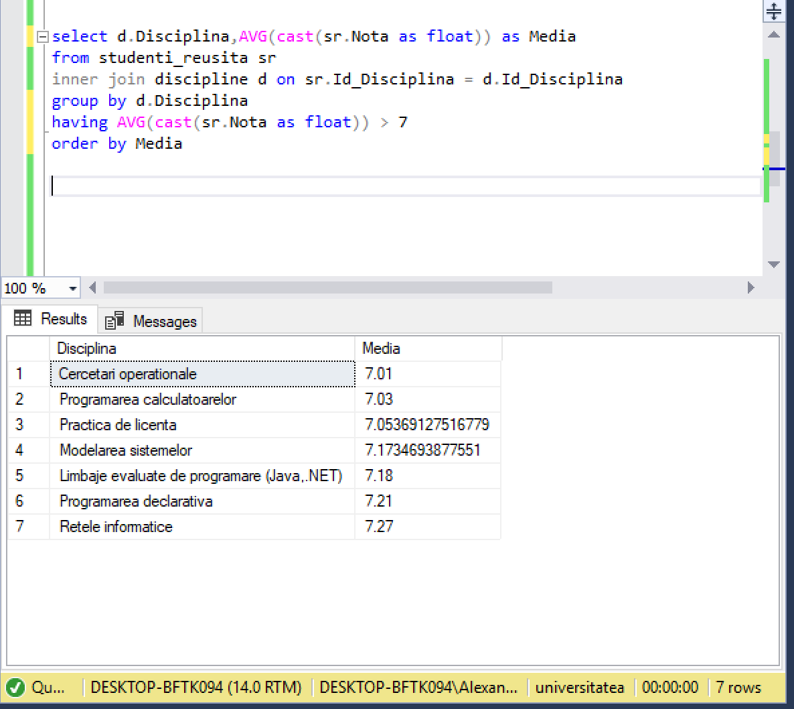

# Laboratorul Nr.4

1. Interogarea Nr. 19
Gasiti Numele si Prenumele profesorilor, care au predat discipline, in care studentul "Cosovanu" a fost respins (nota<5) la cel putin o proba.

```SQL
select distinct Nume_Profesor,Prenume_Profesor
from studenti_reusita sr
inner join profesori p on sr.Id_Profesor = p.Id_Profesor
inner join studenti s on sr.Id_Student = s.Id_Student
where s.Nume_Student = 'Cosovanu' and sr.Nota<5
```




2. Interogarea Nr. 33
Gasiti Numele si Prenumele studentilor, care nu au luat nota de promovare la reusita curenta la nici o disciplina.
```SQL
select distinct Nume_Student, Prenume_Student
from studenti_reusita sr
inner join studenti s on sr.Id_Student = s.Id_Student
where sr.Tip_Evaluare = 'Reusita curenta' and sr.Nota<5
```




3. Interogarea Nr. 35
Gasiti denumirile disciplinelor si media notelor pe disciplina. Afisati numai disciplinele cu medii mai mari de 7.0.

```SQL
select d.Disciplina,AVG(cast(sr.Nota as float)) as Media
from studenti_reusita sr
inner join discipline d on sr.Id_Disciplina = d.Id_Disciplina
group by d.Disciplina
having AVG(cast(sr.Nota as float)) > 7
order by Media
```


```SQL
/*Interogarea 1*/
select *
from grupe

/*Interogarea 2*/
select *
from discipline
order by Nr_ore_plan_disciplina DESC

/*Interogarea 3*/
select distinct  Nume_Profesor, Prenume_Profesor, Disciplina
from studenti_reusita sr
inner join discipline d on sr.Id_Disciplina = d.Id_Disciplina
inner join profesori p on sr.Id_Profesor = p.Id_Profesor
order by p.Nume_Profesor DESC,p.Prenume_Profesor DESC

/*Interogarea 4*/
select Disciplina
from discipline
where LEN(Disciplina) > 20

/*Interogarea 5*/
select *
from studenti
where Nume_Student like '%u'

/*Interogarea 6*/
select distinct top(5) Nume_Student, Prenume_Student,Nota
from studenti_reusita sr
inner join discipline d on sr.Id_Disciplina = d.Id_Disciplina
inner join studenti s on sr.Id_Student = s.Id_Student
where d.Disciplina = 'Baze de date' and sr.Tip_Evaluare = 'Testul 2'
order by Nota DESC

/*Interogarea 7*/
select distinct Cod_grupa
from studenti_reusita sr
inner join studenti s on sr.Id_Student = s.Id_Student
inner join grupe g on sr.Id_Grupa = g.Id_Grupa
where Adresa_Postala_Student like '%31 August%'

/* Interogarea 8*/
select distinct sr.Id_Student, Nume_Student
from studenti_reusita sr
inner join studenti s on sr.Id_Student = s.Id_Student
where Data_Evaluare like '2018%' and Tip_Evaluare = 'Examen'

/*Interogarea 9*/
select distinct Nume_Student,Adresa_Postala_Student,Id_Disciplina
from studenti_reusita sr
inner join studenti s on sr.Id_Student = s.Id_Student
where Data_Evaluare like '2018%' and Nota > 8

/*Interogarea 10*/
select distinct Nume_Student,Prenume_Student
from studenti_reusita sr
inner join studenti s on sr.Id_Student = s.Id_Student
inner join discipline d on sr.Id_Disciplina = d.Id_Disciplina
where Disciplina = 'Baze de date' and Data_Evaluare like '2018%' and Nota >4 and Nota <8

/*Interogarea 11*/
select distinct Nume_Profesor, Prenume_Profesor
from studenti_reusita sr
inner join profesori p on sr.Id_Profesor = p.Id_Profesor
inner join discipline d on sr.Id_Disciplina = d.Id_Disciplina
where Disciplina = 'Baze de date' and Data_Evaluare like '2018%' and Nota <=4

/*Interogarea 12*/
select distinct s.Nume_Student,s.Prenume_Student, Disciplina,Nota,Data_Evaluare
from studenti_reusita sr
inner join discipline d on sr.Id_Disciplina = d.Id_Disciplina
inner join studenti s on sr.Id_Student = s.Id_Student
where s.Prenume_Student = 'Alex'

/*Interogarea 13*/
select distinct Disciplina
from studenti_reusita sr
inner join discipline d on sr.Id_Disciplina = d.Id_Disciplina
inner join studenti s on sr.Id_Student = s.Id_Student
where s.Prenume_Student = 'Ioan' and s.Nume_Student = 'Florea'

/*Interogarea 14*/
select distinct Nume_Student, Prenume_Student,Disciplina
from studenti_reusita sr
inner join discipline d on sr.Id_Disciplina = d.Id_Disciplina
inner join studenti s on sr.Id_Student = s.Id_Student
where Tip_Evaluare = 'Examen' and Nota >8

/*Interogarea 15*/
select distinct Nume_Student, Prenume_Student
from studenti_reusita sr
inner join profesori p on sr.Id_Profesor = p.Id_Profesor
inner join studenti s on sr.Id_Student = s.Id_Student
where p.Prenume_Profesor like'Ion' or p.Prenume_Profesor like'Gheorghe' and Nota >4

/*Interogarea 16*/
select distinct Nume_Student, Prenume_Student, Id_Profesor
from studenti_reusita sr
inner join studenti s on sr.Id_Student = s.Id_Student
inner join discipline d on sr.Id_Disciplina = d.Id_Disciplina
where Nr_ore_plan_disciplina < 60

/*Interogarea 17*/
select distinct Nume_Profesor, Prenume_Profesor
from studenti_reusita sr
inner join profesori p on sr.Id_Profesor = p.Id_Profesor
where Id_Student = 100

/*Interogarea 18*/
select distinct Nume_Profesor, Prenume_Profesor
from studenti_reusita sr
inner join profesori p on sr.Id_Profesor = p.Id_Profesor
inner join discipline d on sr.Id_Disciplina = d.Id_Disciplina
where Nr_ore_plan_disciplina < 60

/*Interogarea 19*/
select distinct Nume_Profesor,Prenume_Profesor
from studenti_reusita sr
inner join profesori p on sr.Id_Profesor = p.Id_Profesor
inner join studenti s on sr.Id_Student = s.Id_Student
where s.Nume_Student = 'Cosovanu' and sr.Nota<5

/*Interogarea 20*/
select distinct count(Nume_Student) as Numar_studenti
from studenti_reusita sr
inner join studenti s on sr.Id_Student = s.Id_Student
inner join discipline d on sr.Id_Disciplina = d.Id_Disciplina
where Tip_Evaluare like'Testul 2' and Disciplina like'Baze de date' and Nota >5

/*Interogarea 21*/ 
select s.Nume_Student,s.Prenume_Student,count(sr.Nota) as Nr_note
from studenti_reusita sr
inner join studenti s on sr.Id_Student = s.Id_Student
group by s.Nume_Student,s.Prenume_Student

/*Interogarea 22*/
select p.Nume_Profesor,p.Prenume_Profesor,count(distinct d.Id_disciplina) as Nr
from studenti_reusita sr
inner join discipline d on sr.Id_Disciplina = d.Id_Disciplina
inner join profesori p on sr.Id_Profesor = p.Id_Profesor
group by p.Nume_Profesor,p.Prenume_Profesor

/*Interogarea 23*/
select distinct Disciplina
from studenti_reusita sr
inner join discipline d on sr.Id_Disciplina = d.Id_Disciplina
where Tip_Evaluare like'Examen' and Nota >7
order by Disciplina DESC

/*Interogarea 24*/
select d.Disciplina,count( distinct p.Id_Profesor) as Numar
from studenti_reusita sr
inner join discipline d on sr.Id_Disciplina = d.Id_Disciplina
inner join profesori p on sr.Id_Profesor = p.Id_Profesor
group by d.Disciplina
having count(distinct p.Id_Profesor) >=2

/*Interogarea 25*/
select g.Cod_Grupa,count( distinct sr.Id_Student) as Numar
from studenti_reusita sr
inner join grupe g on sr.Id_Grupa = g.Id_Grupa
group by g.Cod_Grupa
having count( distinct sr.Id_Student) >=24

/*Interogarea 26!!!!!!!!!!!!!!!!!!!!!!!!!!!!!!!!!!!*/
select distinct Nume_Profesor,Prenume_Profesor,Adresa_Postala_Profesor,
Nume_Student,Prenume_Student,Adresa_Postala_Student
from studenti_reusita sr
full join profesori p on sr.Id_Profesor = p.Id_Profesor
full join studenti s on sr.Id_Student = s.Id_Student
where Adresa_Postala_Student like '%31 August%' and Adresa_Postala_Student like '%31 August%'

/*Interogarea 27*/
select distinct s.Id_Student
from studenti_reusita sr
inner join profesori p on sr.Id_Profesor = p.Id_Profesor
inner join studenti s on sr.Id_Student = s.Id_Student
where sr.Tip_Evaluare like 'Examen' and sr.Nota >4 and p.Prenume_Profesor = 'Ion'

/*Interogarea 28*/
--------------------------
/*INterogarea 29!!!!!!!!!!!!!!!!!!!!!!!!!!!!!!!!!!!!*/
select Id_Disciplina, min(Nota) as Minim
from studenti_reusita
where Id_Student=100 and Tip_Evaluare like 'Examen'
group by Id_Disciplina

/*Interogarea 30*/
select count(distinct Id_Student) as Nr_Studenti
from studenti_reusita sr
inner join discipline d on sr.Id_Disciplina = d.Id_Disciplina
where Disciplina like 'Baze de date' and Data_Evaluare between '2018-01-01' and '2019-12-31'

/*Interogarea 32*/
select s.Nume_Student,s.Prenume_Student,g.Cod_Grupa,avg(cast(Nota as float)) as Media
from studenti_reusita sr
inner join studenti s on sr.Id_Student = s.Id_Student
inner join grupe g on sr.Id_Grupa = g.Id_Grupa
group by s.Nume_Student,s.Prenume_Student,g.Cod_Grupa
order by g.Cod_Grupa

/*Interogarea 33*/
select distinct Nume_Student, Prenume_Student
from studenti_reusita sr
inner join studenti s on sr.Id_Student = s.Id_Student
where sr.Tip_Evaluare = 'Reusita curenta' and sr.Nota<5


/*Interogarea 35*/
select d.Disciplina,AVG(cast(sr.Nota as float)) as Media
from studenti_reusita sr
inner join discipline d on sr.Id_Disciplina = d.Id_Disciplina
group by d.Disciplina
having AVG(cast(sr.Nota as float)) > 7
order by Media

/*Interogarea 39*/
select distinct d.Disciplina
from studenti_reusita sr
inner join discipline d on sr.Id_Disciplina = d.Id_Disciplina
inner join studenti s on sr.Id_Student = s.Id_Student
where sr.Tip_Evaluare like 'Examen'
group by d.Disciplina
having cast(count(case when sr.Nota < 5 then sr.Nota else NULL end) as float)/
count (s.Nume_Student)<0.05
```