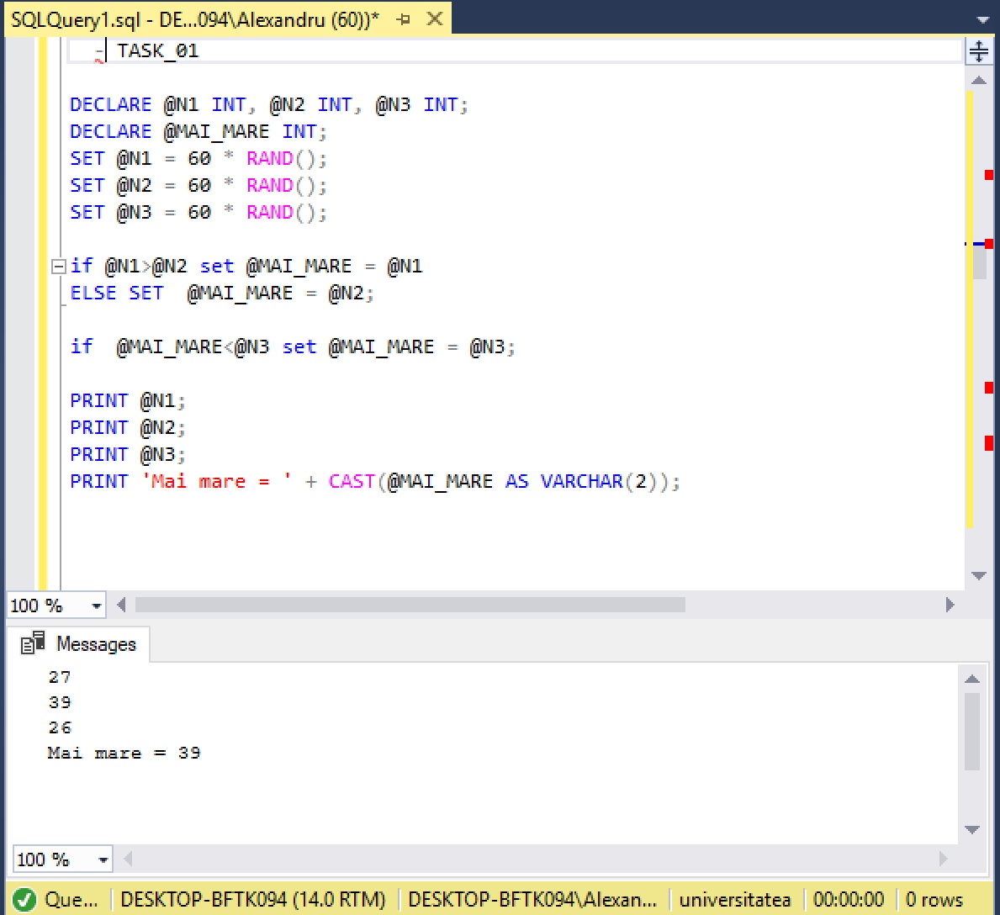
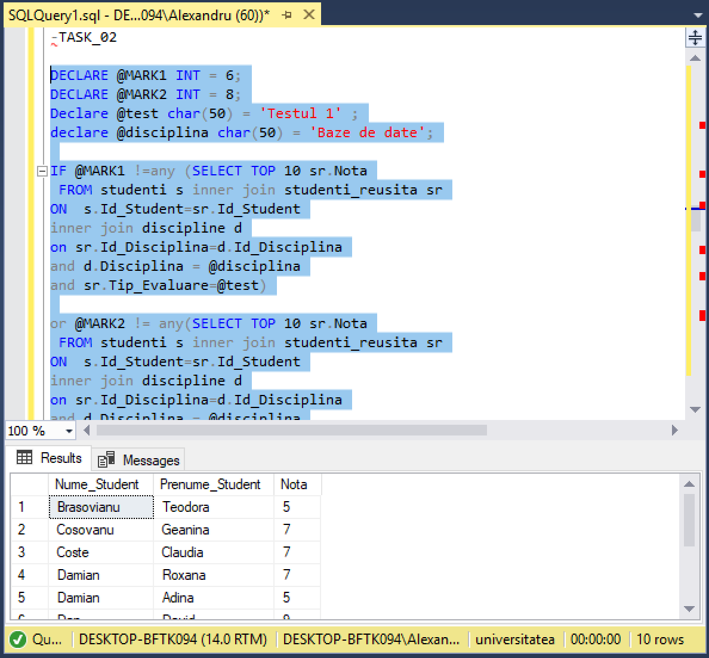
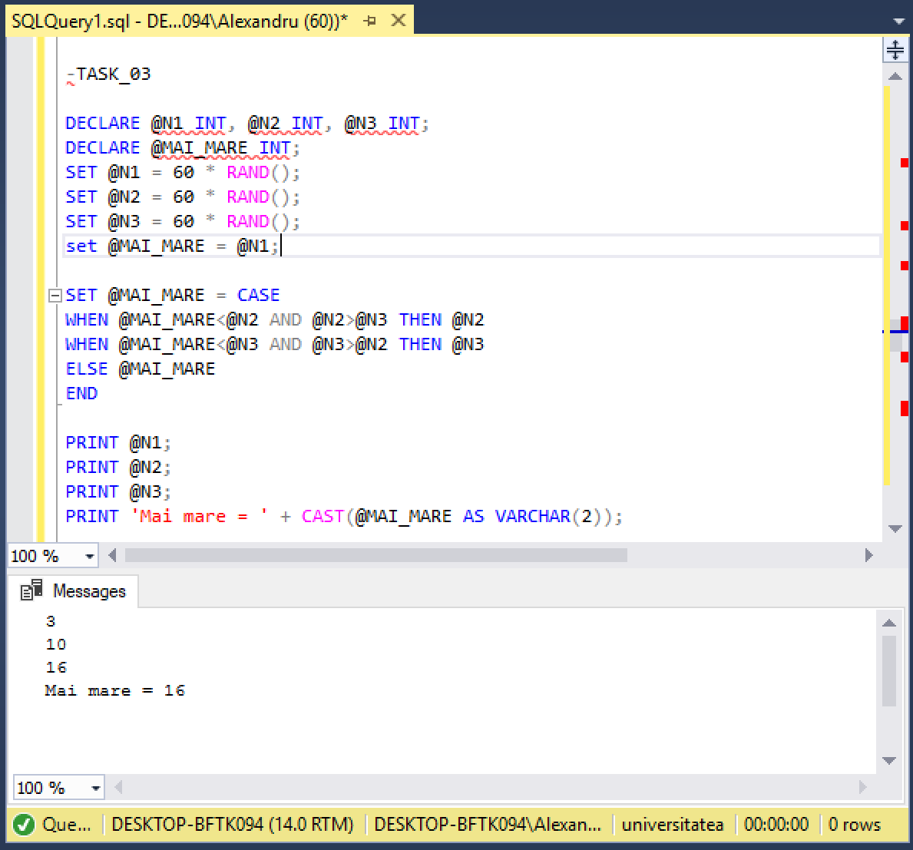
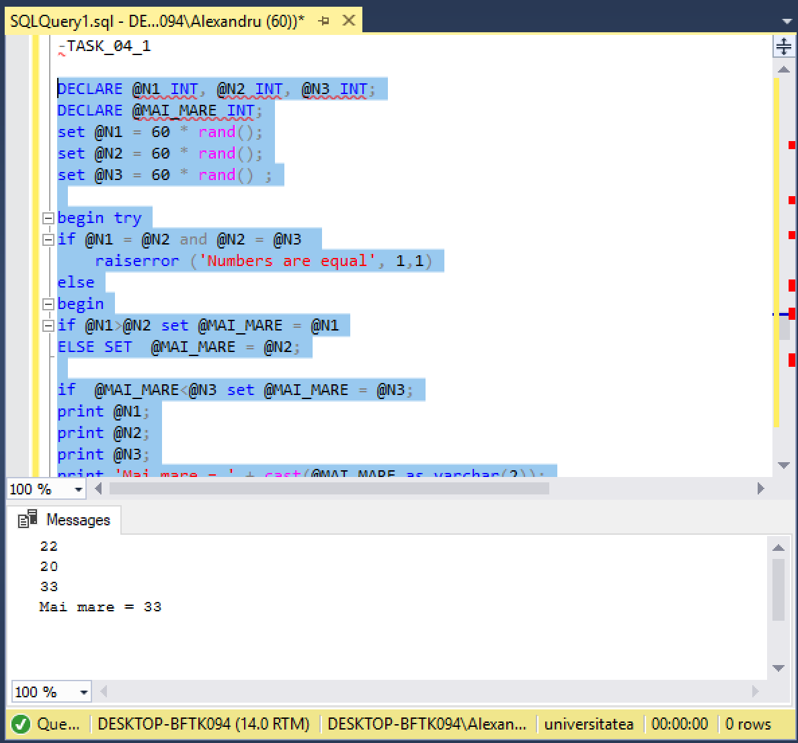
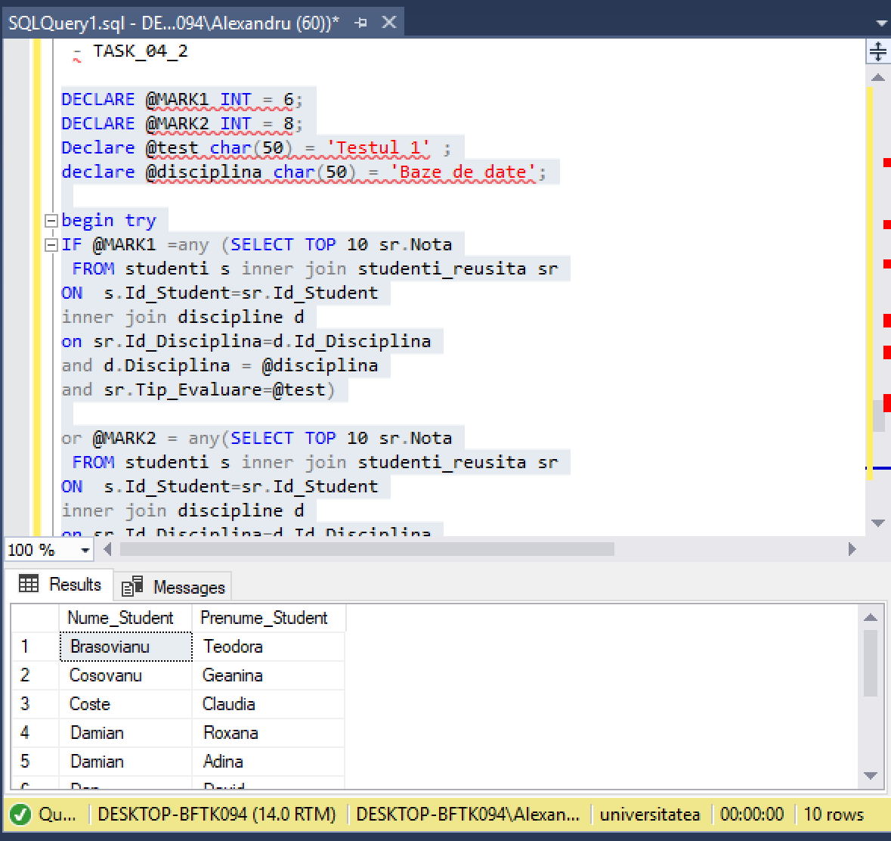

# Laboratorul Nr.5
# TRANSACT-SQL-INSTRUCTIUNI PROCEDURALE

TASK_01
Completati următorul cod pentru a afișa cel mai mare numar dintre cele trei numere prezentate:

```SQL
DECLARE @N1 INT, @N2 INT, @N3 INT;
DECLARE @MAI_MARE INT;
SET @N1 = 60 * RAND();
SET @N2 = 60 * RAND();
SET @N3 = 60 * RAND();

if @N1>@N2 set @MAI_MARE = @N1
ELSE SET  @MAI_MARE = @N2;

if  @MAI_MARE<@N3 set @MAI_MARE = @N3;

PRINT @N1;
PRINT @N2;
PRINT @N3;
PRINT 'Mai mare = ' + CAST(@MAI_MARE AS VARCHAR(2));
```




- TASK_02
Afișati primele zece date (numele, prenumele studentului) în funcție de valoarea notei (cu excepția notelor 6 și 8) a studentului la primul test al disciplinei Baze de date, folosind structura de altemativă IF. .. ELSE. Sa se foloseasca variabilele.

```SQL
DECLARE @MARK1 INT = 6;
DECLARE @MARK2 INT = 8;
Declare @test char(50) = 'Testul 1' ;
declare @disciplina char(50) = 'Baze de date';

IF @MARK1 !=any (SELECT TOP 10 sr.Nota
 FROM studenti s inner join studenti_reusita sr
ON	s.Id_Student=sr.Id_Student
inner join discipline d
on sr.Id_Disciplina=d.Id_Disciplina
and d.Disciplina = @disciplina
and sr.Tip_Evaluare=@test)

or @MARK2 != any(SELECT TOP 10 sr.Nota
 FROM studenti s inner join studenti_reusita sr
ON	s.Id_Student=sr.Id_Student
inner join discipline d
on sr.Id_Disciplina=d.Id_Disciplina
and d.Disciplina = @disciplina
and sr.Tip_Evaluare=@test)


begin
SELECT  distinct TOP 10  s.Nume_Student,s.Prenume_Student,sr.Nota
FROM studenti s inner join studenti_reusita sr
ON	s.Id_Student=sr.Id_Student
inner join discipline d
on sr.Id_Disciplina=d.Id_Disciplina
and d.Disciplina = @disciplina
and sr.Tip_Evaluare=@test
end
```




-TASK_03
Rezolvati aceeași sarcină, 1, apelând la structura selectivâ CASE.

```SQL
DECLARE @N1 INT, @N2 INT, @N3 INT;
DECLARE @MAI_MARE INT;
SET @N1 = 60 * RAND();
SET @N2 = 60 * RAND();
SET @N3 = 60 * RAND();
set @MAI_MARE = @N1;

SET @MAI_MARE = CASE 
WHEN @MAI_MARE<@N2 AND @N2>@N3 THEN @N2
WHEN @MAI_MARE<@N3 AND @N3>@N2 THEN @N3
ELSE @MAI_MARE
END

PRINT @N1;
PRINT @N2;
PRINT @N3;
PRINT 'Mai mare = ' + CAST(@MAI_MARE AS VARCHAR(2));
```


-TASK_04_01
Modificati exercitiile din sarcinile 1 și 2 pentru a include procesarea erorilor cu TRY și CATCH, și RAISERRROR.

```SQL
DECLARE @N1 INT, @N2 INT, @N3 INT;
DECLARE @MAI_MARE INT;
set @N1 = 60 * rand();
set @N2 = 60 * rand();
set @N3 = 60 * rand() ;

begin try
if @N1 = @N2 and @N2 = @N3 
    raiserror ('Numbers are equal', 1,1)
else
begin
if @N1>@N2 set @MAI_MARE = @N1
ELSE SET  @MAI_MARE = @N2;

if  @MAI_MARE<@N3 set @MAI_MARE = @N3;
print @N1;
print @N2;
print @N3;
print 'Mai mare = ' + cast(@MAI_MARE as varchar(2));
end
end try

begin catch
print ' An error has been occured!' 
print 'The details of the error'
print ' The error status:' + cast(ERROR_STATE() as varchar(20))
print ' The error line:' + cast(ERROR_LINE() as varchar(20))
end catch
```


-TASK_04_02

```SQL
DECLARE @MARK1 INT = 6;
DECLARE @MARK2 INT = 8;
Declare @test char(50) = 'Testul 1' ;
declare @disciplina char(50) = 'Baze de date';

begin try
IF @MARK1 =any (SELECT TOP 10 sr.Nota
 FROM studenti s inner join studenti_reusita sr
ON	s.Id_Student=sr.Id_Student
inner join discipline d
on sr.Id_Disciplina=d.Id_Disciplina
and d.Disciplina = @disciplina
and sr.Tip_Evaluare=@test)

or @MARK2 = any(SELECT TOP 10 sr.Nota
 FROM studenti s inner join studenti_reusita sr
ON	s.Id_Student=sr.Id_Student
inner join discipline d
on sr.Id_Disciplina=d.Id_Disciplina
and d.Disciplina = @disciplina
and sr.Tip_Evaluare=@test)

raiserror('Toti studenti au numai note de 6 si 8',2,2);
else

begin
SELECT  distinct TOP 10  s.Nume_Student,s.Prenume_Student
FROM studenti s inner join studenti_reusita sr
ON	s.Id_Student=sr.Id_Student
inner join discipline d
on sr.Id_Disciplina=d.Id_Disciplina
and d.Disciplina = @disciplina
and sr.Tip_Evaluare=@test

end
end try
begin catch
print ' An error has been occured!' 
print 'The details of the error'
print ' The error status:' + cast(ERROR_STATE() as varchar(20))
print ' The error line:' + cast(ERROR_LINE() as varchar(20))
end catch
```

