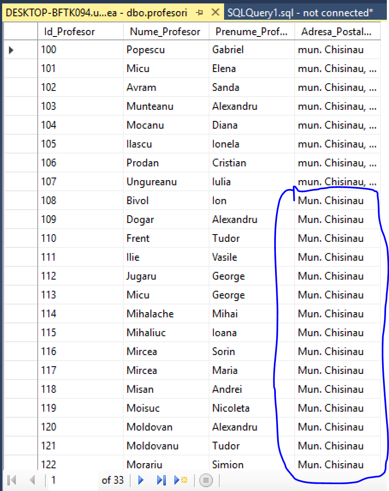
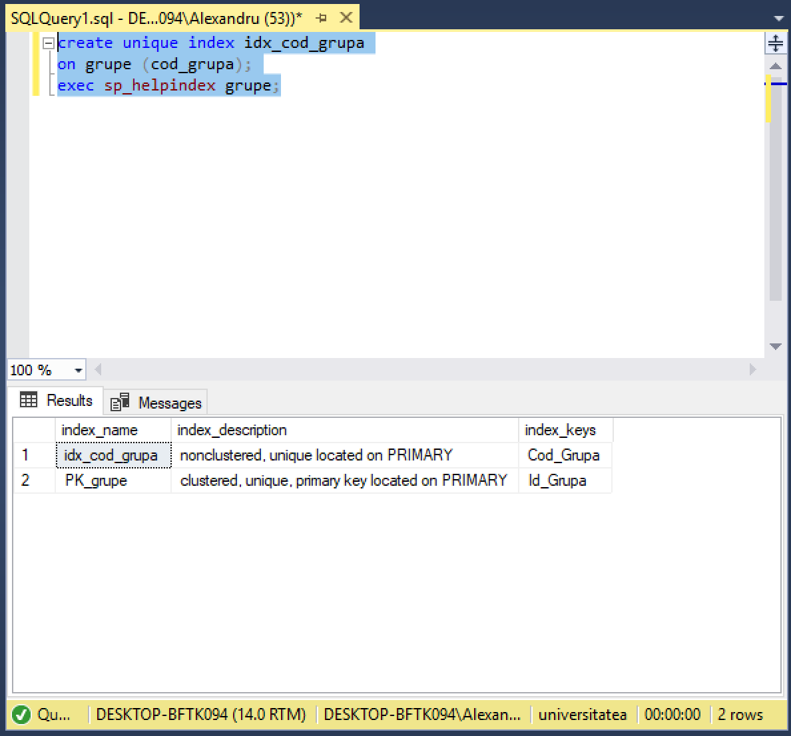
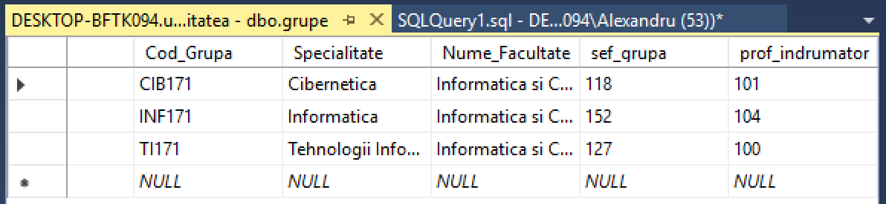
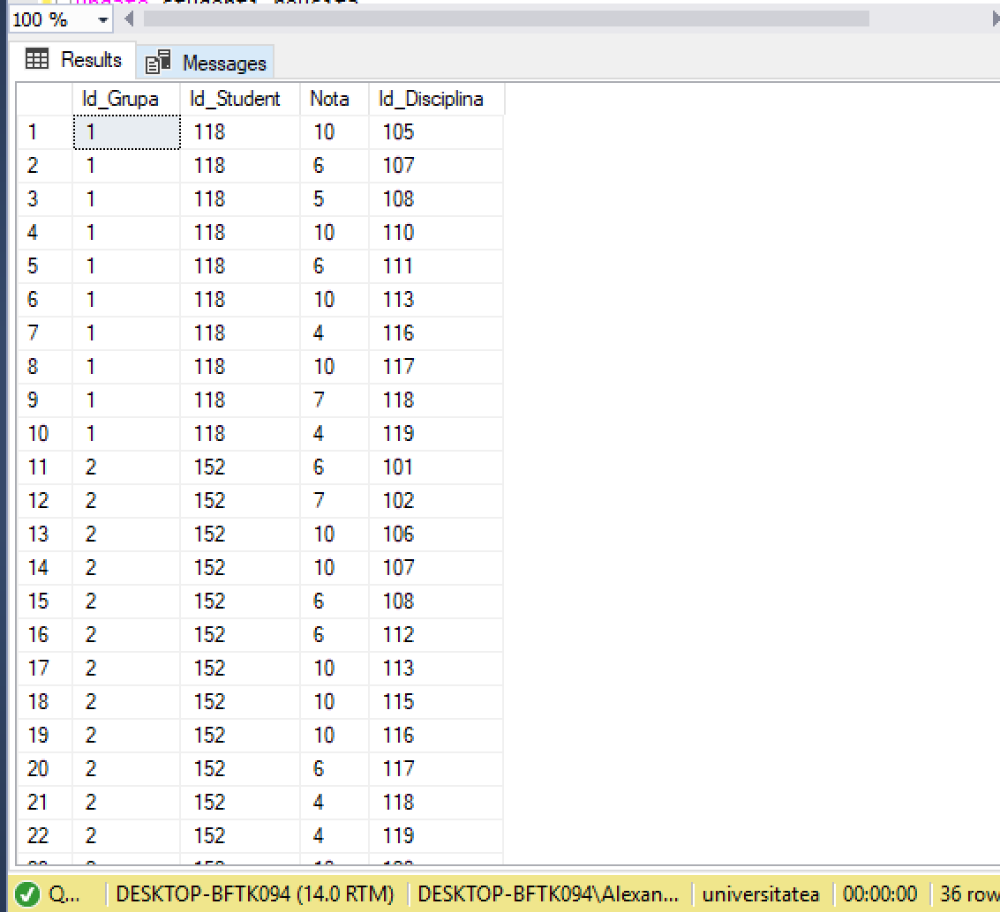
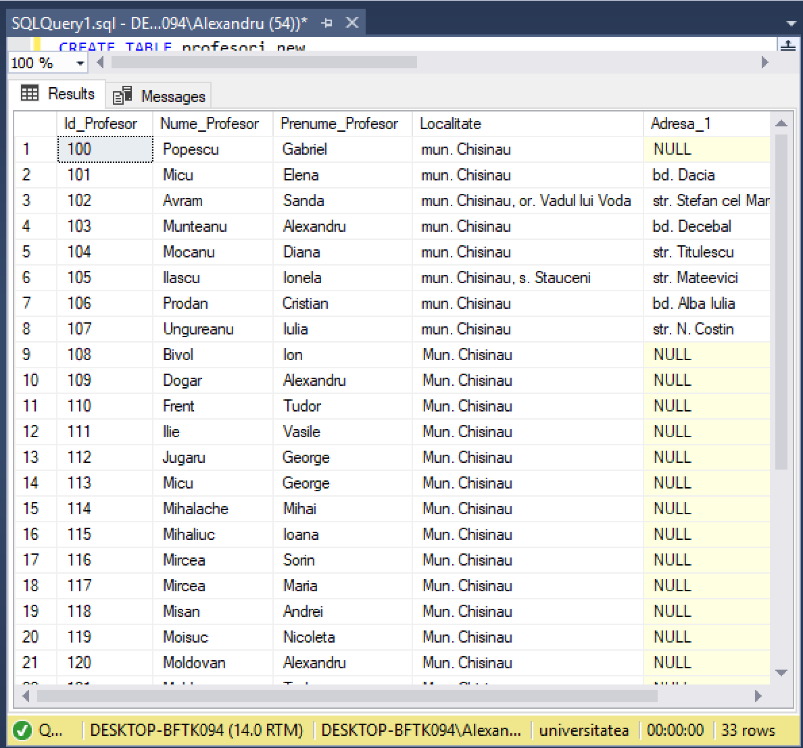
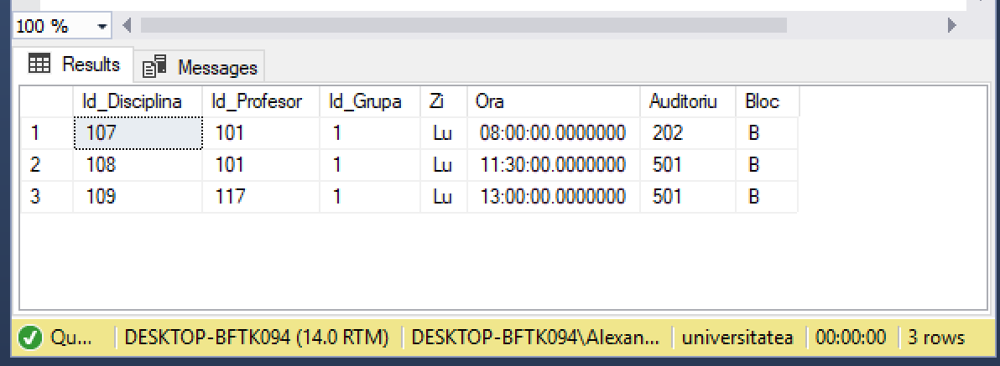

# Laboratorul Nr.6
# CREAREA TABELELOR SI INDECSILOR

#TASK_01
Sa se scrie o instructiune T-SQL, care ar popula coloana Adresa _ Postala _ Profesor din tabelul profesori cu valoarea 'Mun. Chisinau', unde adresa este necunoscuta:

```SQL
use universitatea
go
update profesori
set Adresa_Postala_Profesor = 'Mun. Chisinau'
where Adresa_Postala_Profesor is null
```



#TASK_02
Sa se modifice schema tabelului grupe, ca sa corespunda urmatoarelor cerinte: a) Campul Cod_ Grupa sa accepte numai valorile unice ~i sa nu accepte valori necunoscute. b) Sa se tina cont ca cheie primarii, deja, este definitii asupra coloanei Id_ Grupa.
```SQL
create unique index idx_cod_grupa
on grupe (cod_grupa);
exec sp_helpindex grupe;
```



#TASK_03
La tabelul "grupe", sa se adauge 2 coloane noi "Sef_grupa" si "Prof_Indrumator", ambele de tip INT. Sa se populeze campurile nou-create cu cele mai potrivite candidaturi in baza criteriilor de mai jos: 
a) "Seful grupei" trebuie sa aiba cea mai buna reusita (medie) din grupa la toate formele de evaluare si la toate disciplinele. Un student nu poate fi sef de grupa la mai multe grupe. 
b) Profesorul indrumator trebuie sa predea un numar maximal posibil de discipline la grupa data. Daca nu exista o singura candidatura, care corespunde primei cerinte, atunci este ales din grupul de candidati acel cu identificatorul (Id_Profesor) minimal. Un profesor nu poate fi indrumator la mai multe grupe. 
c) Sa se scrie instructiunile ALTER, SELECT, UPDATE necesare pentru crearea coloanelor in tabelul "grupe", pentru selectarea candidatilor si inserarea datelor.
```SQL
alter table grupe add sef_grupa int, prof_indrumator int;

declare @nr_grupe int = (select count(Id_Grupa) from grupe)
declare @initial int = 1;

while (@initial <= @nr_grupe)
     begin
	    update grupe
		set sef_grupa = (select top 1 sel.Id_Student
		                from (select Id_Student, avg(cast(Nota as float)) as Media
						      from studenti_reusita
							  where Id_Grupa = @initial
							  group by Id_Student) sel
					    order by sel.Media desc),
		prof_indrumator = (select les.Id_Profesor
		                   from(select top 1 Id_Profesor, count(distinct Id_Disciplina) as Nr_discipline
						        from studenti_reusita
								where Id_Grupa = @initial
								group by Id_Profesor
								order by Nr_discipline desc) les)
		where Id_Grupa = @initial
		set @initial = @initial +1;
end

alter table grupe add constraint prof_stud unique(sef_grupa,prof_indrumator);
```



#TASK_04
Sa se scrie o instructiune T-SQL, care ar mari toate notele de evaluare a sefilor de grupe cu un punct. Nota maximala (10) nu poate fi marita:
```SQL
update studenti_reusita
set Nota = Nota + 1
where Tip_Evaluare = 'Examen'
      and Id_Student = any(select sef_grupa 
	                       from grupe)
	  and Nota != 10
```


#TASK_4
Sa se creeze un tabel profesori_new, care include urmatoarele coloane: Id_Profesor,Nume _ Profesor, Prenume _ Profesor, Localitate, Adresa _ 1, Adresa _ 2.

#4_A: Coloana Id_Profesor trebuie sa fie definita drept cheie primara și, în baza ei, sa fie construit un index CLUSTERED.

#4_B: Cîmpul Localitate trebuie sa posede proprietatea DEFAULT= 'mun. Chisinau'.

#4_C: Să se insereze toate datele din tabelul profesori în tabelul profesori_new. Să se scrie, cu acest scop, un număr potrivit de instrucțiuni T-SQL.

În coloana Localitate să fie inserata doar informatia despre denumirea localității din coloana-sursă Adresa_Postala_Profesor. În coloana Adresa_l, doar denumirea străzii. În coloana Adresa_2, să se păstreze numărul casei și (posibil) a apartamentului.

```SQL
CREATE TABLE profesori_new
(
	Id_Profesor int NOT NULL,
	Nume_Profesor char (50),
	Prenume_Profesor char (50),
	Localitate char (60) DEFAULT ('mun. Chisinau'),
	Adresa_1 char (60),
	Adresa_2 char (60),
	CONSTRAINT [PK_profesori_new] PRIMARY KEY CLUSTERED (Id_Profesor )
) ON [PRIMARY]

INSERT INTO profesori_new (Id_Profesor,Nume_Profesor, Prenume_Profesor, Localitate,Adresa_1, Adresa_2)
(SELECT Id_Profesor, Nume_Profesor, Prenume_Profesor, Adresa_Postala_Profesor, Adresa_Postala_Profesor, Adresa_Postala_Profesor
from profesori)

UPDATE profesori_new
SET Localitate = case when CHARINDEX(', s.',Localitate) >0
				 then case when CHARINDEX (', str.',Localitate) > 0
							then SUBSTRING (Localitate,1, CHARINDEX (', str.',Localitate)-1)
					        when CHARINDEX (', bd.',Localitate) > 0
							then SUBSTRING (Localitate,1, CHARINDEX (', bd.',Localitate)-1)
				      end
				  when  CHARINDEX(', or.',Localitate) >0
				 then case when CHARINDEX (', str.',Localitate) > 0
							then SUBSTRING (Localitate,1, CHARINDEX ('str.',Localitate)-3)
					        when CHARINDEX (', bd.',Localitate) > 0
							then SUBSTRING (Localitate,1, CHARINDEX ('bd.',Localitate)-3)
					  end
				when CHARINDEX('nau',Localitate) >0
				then SUBSTRING(Localitate, 1, CHARINDEX('nau',Localitate)+2)
				end
UPDATE profesori_new
SET Adresa_1 = case when CHARINDEX('str.', Adresa_1)>0
					then SUBSTRING(Adresa_1,CHARINDEX('str',Adresa_1), PATINDEX('%, [0-9]%',Adresa_1)- CHARINDEX('str.',Adresa_1))
			        when CHARINDEX('bd.',Adresa_1)>0
					then SUBSTRING(Adresa_1,CHARINDEX('bd',Adresa_1), PATINDEX('%, [0-9]%',Adresa_1) -  CHARINDEX('bd.',Adresa_1))
			   end

UPDATE profesori_new
SET Adresa_2 = case when PATINDEX('%, [0-9]%',Adresa_2)>0
					then SUBSTRING(Adresa_2, PATINDEX('%, [0-9]%',Adresa_2)+1,len(Adresa_2) - PATINDEX('%, [0-9]%',Adresa_2)+1)
				end
				
select * from profesori_new
```



#TASK_6
Să se insereze datele in tabelul orarul pentru Grupa= 'CIBJ 71' (Id_ Grupa= 1) pentru ziua de luni. Toate lectiile vor avea loc în blocul de studii 'B'. Mai jos, sunt prezentate detaliile de inserare:

(ld_Disciplina = 107, Id_Profesor= 101, Ora ='08:00', Auditoriu = 202);

(Id_Disciplina = 108, Id_Profesor= 101, Ora ='11:30', Auditoriu = 501);

(ld_Disciplina = 119, Id_Profesor= 117, Ora ='13:00', Auditoriu = 501);

```SQL
create table orarul 
( 
	Id_Disciplina int,
	Id_Profesor int,
	Id_Grupa smallint default(1),
	Zi char(10),
	Ora Time,
    Auditoriu int,
	Bloc char(1) default('B'),
	PRIMARY KEY (Id_Grupa, Zi, Ora, Auditoriu)
					  )
Insert orarul (Id_Disciplina , Id_Profesor, Zi, Ora, Auditoriu)
       values ( 107, 101, 'Luni','08:00', 202 )
Insert orarul (Id_Disciplina , Id_Profesor, Zi, Ora, Auditoriu)
       values ( 108, 101, 'Luni','11:30', 501 )
Insert orarul (Id_Disciplina , Id_Profesor, Zi, Ora, Auditoriu)
       values ( 109, 117, 'Luni','13:00', 501 )

select * from orarul
```

