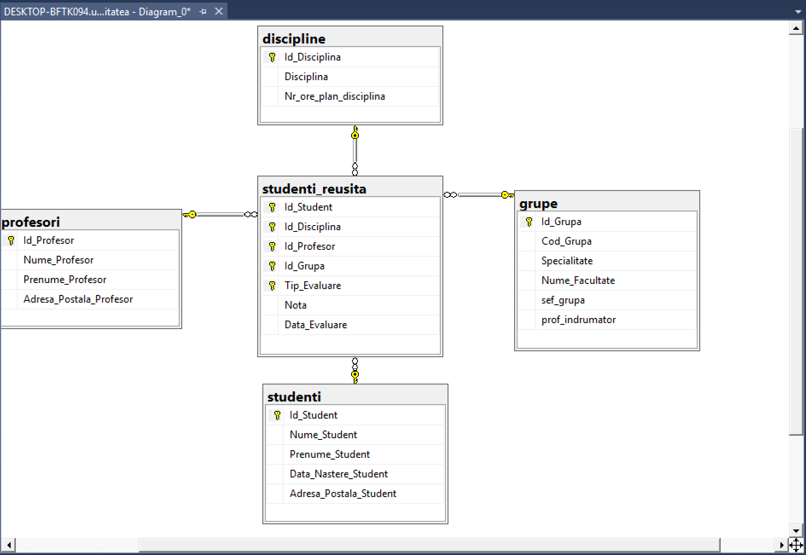
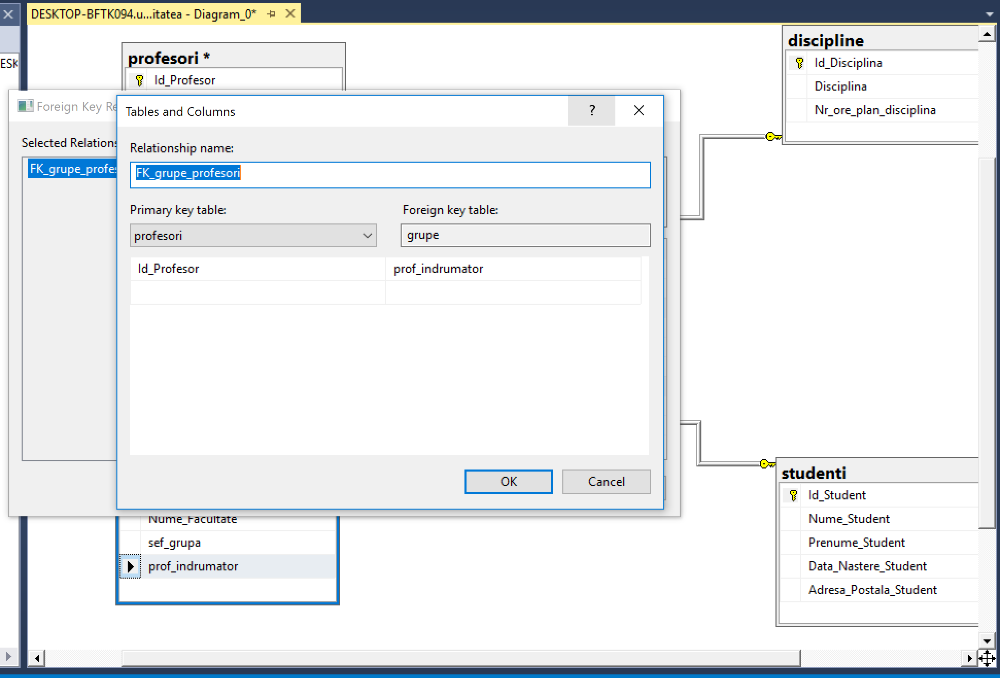
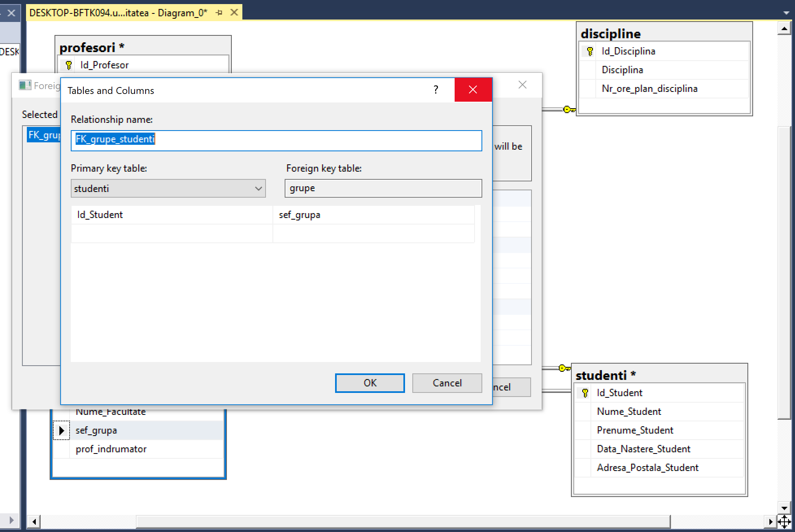
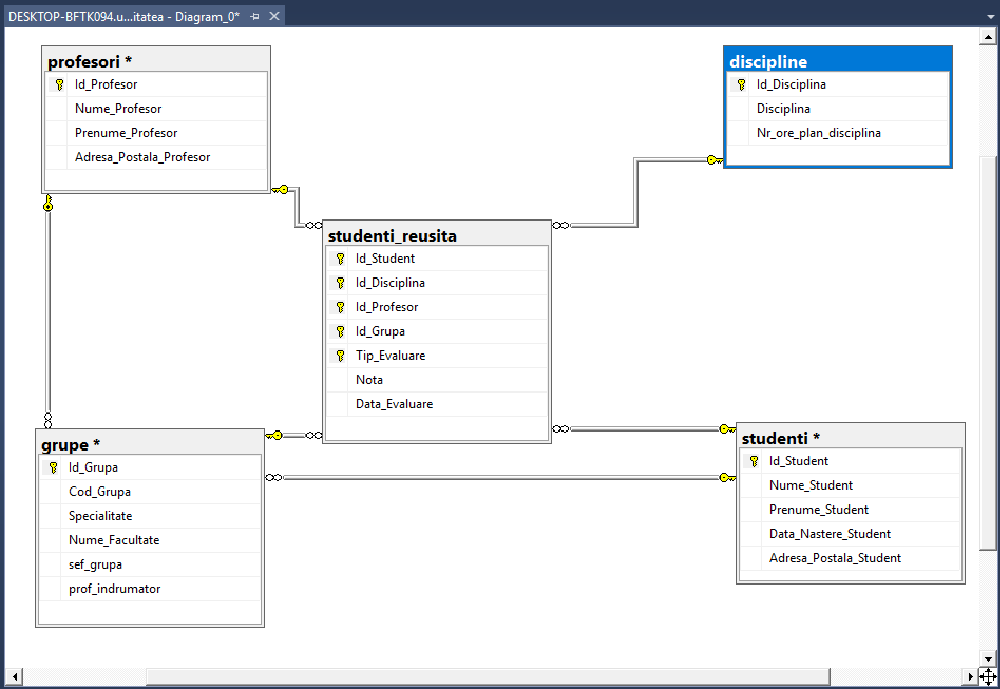
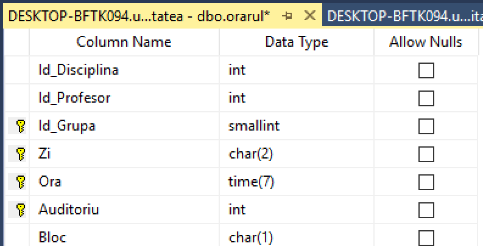
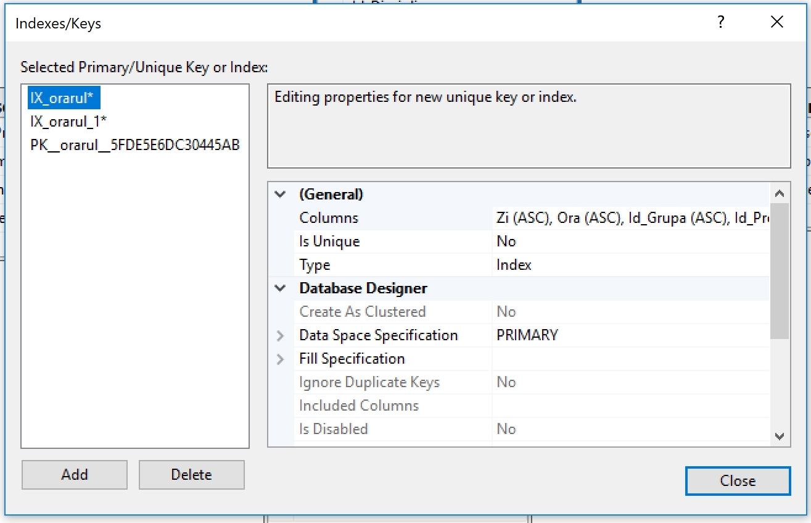
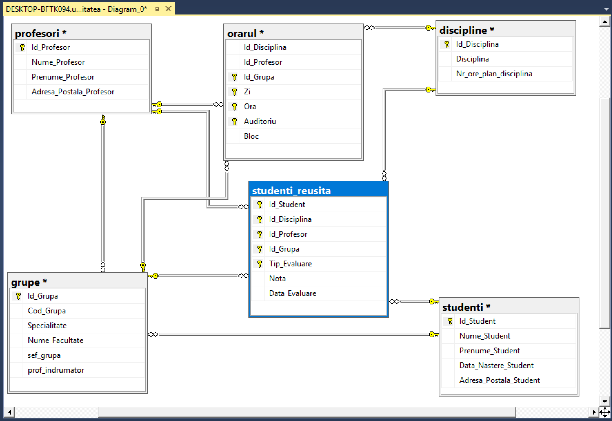
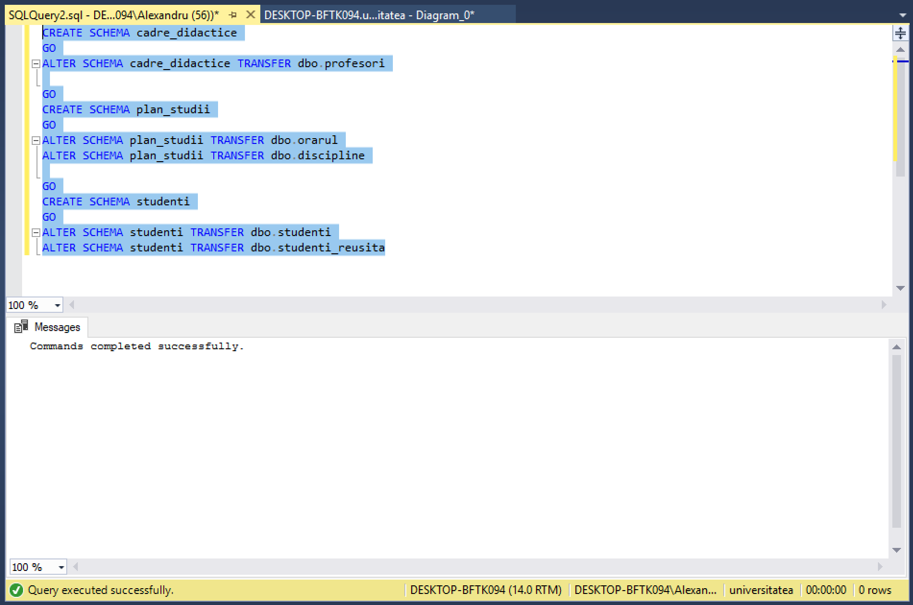
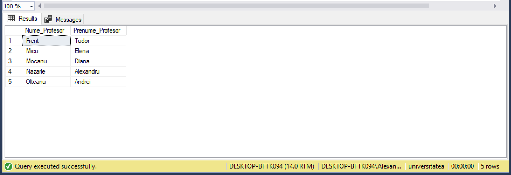
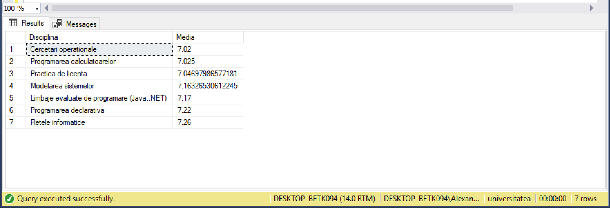

# Laboratorul Nr.7
# Diagrame, Scheme si Sinonime

#TASK_01

Creați o diagramă a bazei de date, folosind forma de vizualizare standard, structura căreia este descrisă la începutul sarcinilor practice din capitolul 4.



#TASK_02

Să se adauge constrîngeri referențiale (legate cu tabelele studenti și profesori) necesare coloanelor Sef_grupa și Prof_Indrumator (sarcina3, capitolul 6) din tabelul grupe







#TASK_03

La diagrama construită, să se adauge și tabelul orarul definit în capitolul 6 al acestei lucrari:tabelul orarul conține identificatorul disciplinei (ld_Disciplina), identificatorul profesorului(Id_Profesor) și blocul de studii (Bloc). Cheia tabelului este constituită din trei cîmpuri:identificatorul grupei (Id_ Grupa), ziua lectiei (Z1), ora de inceput a lectiei (Ora), sala unde are loc lectia (Auditoriu)

```SQL
create table orarul 
( 
	Id_Disciplina int,
	Id_Profesor int,
	Id_Grupa smallint default(1),
	Zi char(10),
	Ora Time,
    Auditoriu int,
	Bloc char(1) default('B'),
	PRIMARY KEY (Id_Grupa, Zi, Ora, Auditoriu)
					  )
Insert orarul (Id_Disciplina , Id_Profesor, Zi, Ora, Auditoriu)
       values ( 107, 101, 'Luni','08:00', 202 )
Insert orarul (Id_Disciplina , Id_Profesor, Zi, Ora, Auditoriu)
       values ( 108, 101, 'Luni','11:30', 501 )
Insert orarul (Id_Disciplina , Id_Profesor, Zi, Ora, Auditoriu)
       values ( 109, 117, 'Luni','13:00', 501 )

INSERT INTO orarul (Id_Disciplina, Id_Profesor, Id_Grupa, Zi, Ora,Auditoriu)
values (
	        (select Id_Disciplina from discipline where Disciplina = 'Structuri de date si algoritmi'),
	        (select Id_Profesor from profesori where Nume_Profesor = 'Bivol' and Prenume_Profesor = 'Ion'),
		    (select Id_Grupa from grupe where Cod_Grupa = 'INF171'), 
		    'Luni', 
		    '08:00',
		    113)

INSERT INTO orarul (Id_Disciplina, Id_Profesor, Id_Grupa, Zi, Ora,Auditoriu)
values (
	        (select Id_Disciplina from discipline where Disciplina = 'Programe aplicative'),
		    (select Id_Profesor from profesori where Nume_Profesor = 'Mircea' and Prenume_Profesor = 'Sorin'),
		    (select Id_Grupa from grupe where Cod_Grupa = 'INF171'), 
		    'Luni', 
		    '11:30',
		    401)

INSERT INTO orarul (Id_Disciplina, Id_Profesor, Id_Grupa, Zi, Ora,Auditoriu)
values (
	        (select Id_Disciplina from discipline where Disciplina = 'Baze de date'),
		    (select Id_Profesor from profesori where Nume_Profesor = 'Micu' and Prenume_Profesor = 'Elena'),
		    (select Id_Grupa from grupe where Cod_Grupa = 'INF171'), 
		    'Luni', 
		    '13:00',
		    805)
```



#TASK_04

Tabelul orarul trebuie să conțină și 2 chei secundare: (Zi, Ora, Id_ Grupa, Id_ Profesor) și (Zi, Ora, ld_Grupa, ld_Disciplina).




#TASK_05

În diagrama, de asemenea, trebuie sa se defineasca constrangerile referentiale (FK-PK) ale atributelor ld_Disciplina, ld_Profesor, Id_ Grupa din tabelului orarul cu atributele tabelelor respective.



#TASK_06

Creați, în baza de date universitatea, trei scheme noi: cadre_didactice, plan_studii și studenti. Transferați tabelul profesori din schema dbo in schema cadre didactice, ținînd cont de dependentele definite asupra tabelului menționat. În același mod să se trateze tabelele orarul,discipline care aparțin schemei plan_studii și tabelele studenți, studenti_reusita, care apartin schemei studenti. Se scrie instructiunile SQL respective.



#TASK_07

Modificati 2-3 interogari asupra bazei de date universitatea prezentate in capitolul 4 astfel ca numele tabelelor accesate sa fie descrise in mod explicit, ținînd cont de faptul ca tabelele au fost mutate in scheme noi.

Interogarea Nr. 19 Gasiti Numele si Prenumele profesorilor, care au predat discipline, in care studentul "Cosovanu" a fost respins (nota<5) la cel putin o proba.

```SQL
select distinct cadre_didactice.profesori.Nume_Profesor,cadre_didactice.profesori.Prenume_Profesor
from studenti.studenti_reusita
inner join cadre_didactice.profesori on studenti.studenti_reusita.Id_Profesor = cadre_didactice.profesori.Id_Profesor
inner join studenti.studenti on studenti.studenti_reusita.Id_Student = studenti.studenti.Id_Student
where studenti.studenti.Nume_Student = 'Cosovanu' and studenti.studenti_reusita.Nota<5
```




Interogarea Nr. 33 Gasiti Numele si Prenumele studentilor, care nu au luat nota de promovare la reusita curenta la nici o disciplina.

```SQL
select distinct studenti.studenti.Nume_Student, studenti.studenti.Prenume_Student
from studenti.studenti_reusita
inner join studenti.studenti on studenti.studenti_reusita.Id_Student = studenti.studenti.Id_Student
where studenti.studenti_reusita.Tip_Evaluare = 'Reusita curenta'
group by studenti.studenti.Nume_Student, studenti.studenti.Prenume_Student
having avg(cast(studenti.studenti_reusita.Nota as float))<5
```

Interogarea Nr. 35 Gasiti denumirile disciplinelor si media notelor pe disciplina. Afisati numai disciplinele cu medii mai mari de 7.0.

```SQL
select plan_studii.discipline.Disciplina,AVG(cast(studenti.studenti_reusita.Nota as float)) as Media
from studenti.studenti_reusita
inner join plan_studii.discipline on studenti.studenti_reusita.Id_Disciplina = plan_studii.discipline.Id_Disciplina
group by plan_studii.discipline.Disciplina
having AVG(cast(studenti.studenti_reusita.Nota as float)) > 7
order by Media
```



#TASK_08

Creați sinonimele respective pentru a simplifica interogările construite în exercițiul precedent și reformulați interogările, folosind sinonimele create.


--19--
```SQL
CREATE SYNONYM stud_St FOR studenti.studenti
CREATE SYNONYM reusita_St FOR studenti.studenti_reusita
CREATE SYNONYM disc_St FOR plan_studii.discipline
CREATE SYNONYM prof_St FOR cadre_didactice.profesori

select distinct prof_St.Nume_Profesor,prof_St.Prenume_Profesor
from reusita_St
inner join prof_St on reusita_St.Id_Profesor = prof_St.Id_Profesor
inner join stud_St on reusita_St.Id_Student = stud_St.Id_Student
where stud_St.Nume_Student = 'Cosovanu' and reusita_St.Nota<5
```

--33--
```SQL
select distinct stud_St.Nume_Student, stud_St.Prenume_Student
from reusita_St
inner join stud_St on reusita_St.Id_Student = stud_St.Id_Student
where reusita_St.Tip_Evaluare = 'Reusita curenta'
group by stud_St.Nume_Student, stud_St.Prenume_Student
having avg(cast(reusita_St.Nota as float))<5
```

--35--
```SQL
select disc_St.Disciplina,AVG(cast(reusita_St.Nota as float)) as Media
from reusita_St
inner join disc_St on reusita_St.Id_Disciplina = disc_St.Id_Disciplina
group by disc_St.Disciplina
having AVG(cast(reusita_St.Nota as float)) > 7
order by Media
```