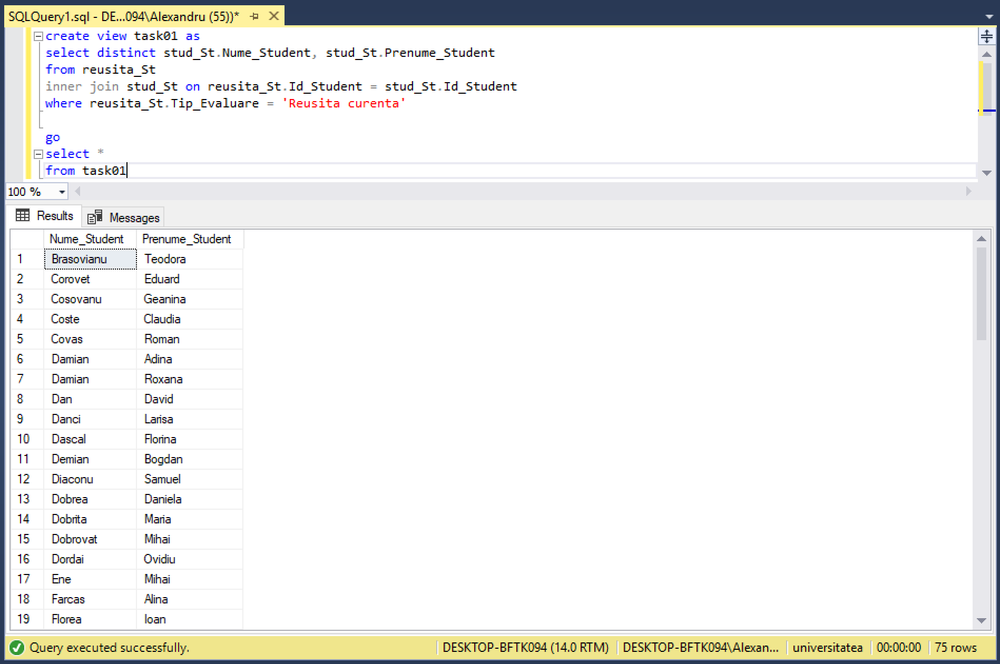
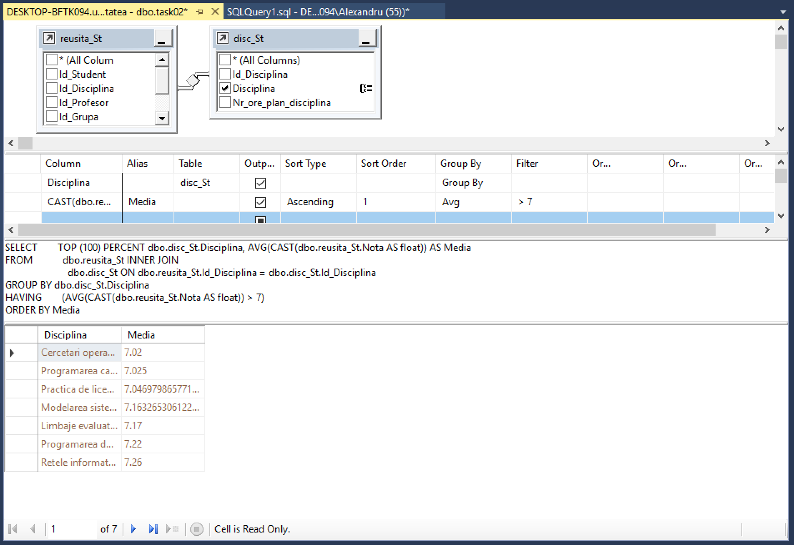
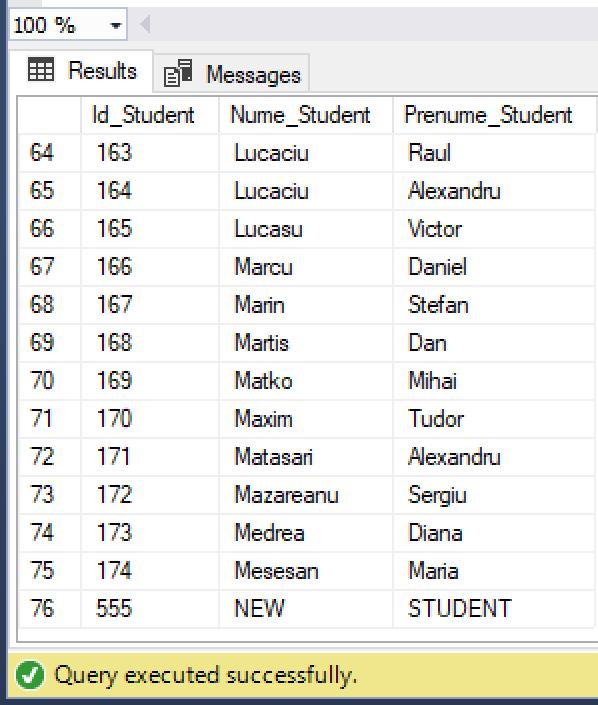
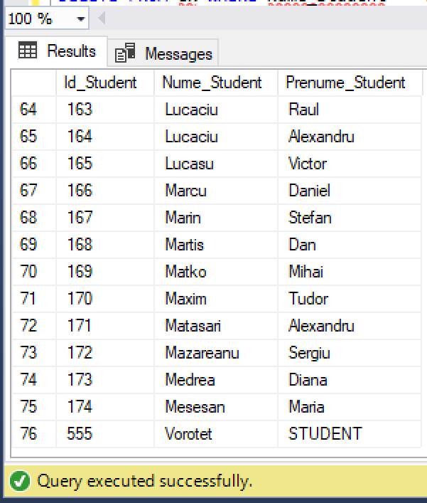
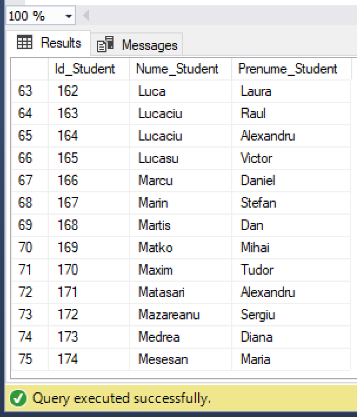
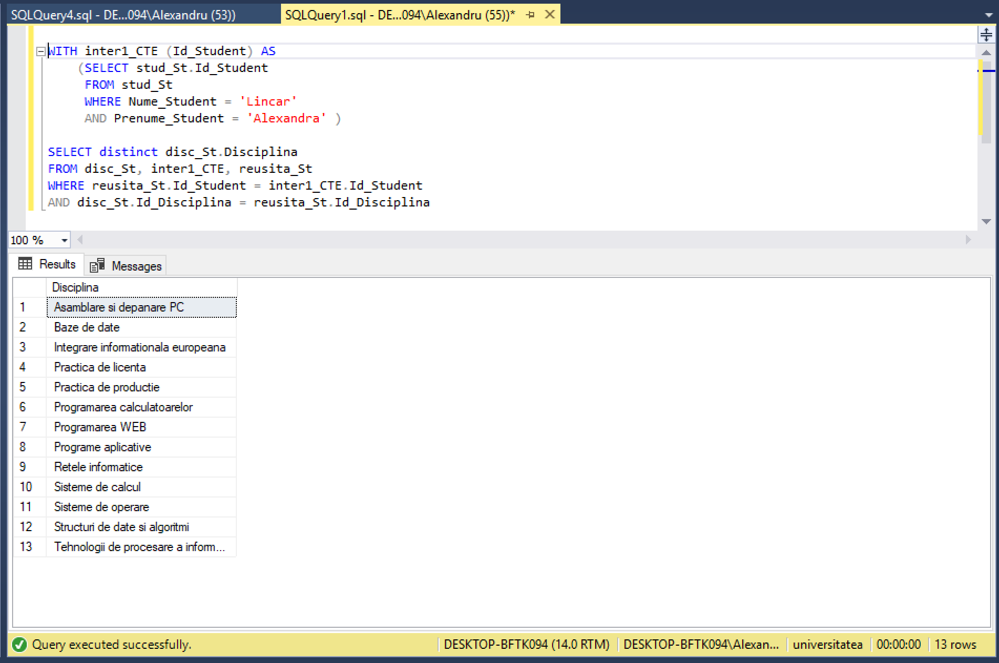
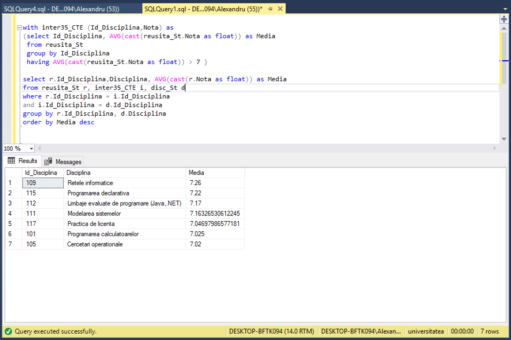
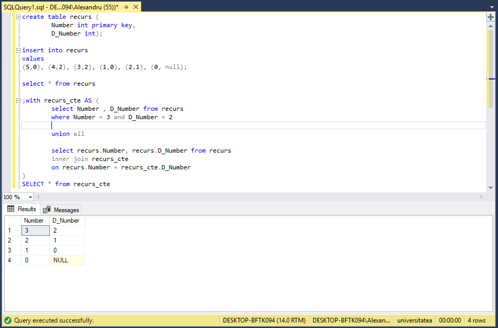

# Laboratorul Nr.8
# Administrarea viziunilor si a expresiilor-tabel

#TASK_01

Sa se creeze doua viziuni in baza interogarilor formulate in doua exercitii indicate din capitolul Prima viziune sa fie construita in Editorul de interogari, iar a doua, utilizand View Designer.

* Editorul de interogari



* View Designer



#TASK_02

Sa se scrie cate un exemplu de instructiuni INSERT, UPDATE, DELETE asupra viziunilor create. Sa se adauge comentariile respective referitoare la rezultatele executarii acestor instructiuni.

```SQL
create view task11 as
select Id_Student,Nume_Student, Prenume_Student
from stud_St

--Inserarea unui student nou in viziunea task01:
INSERT INTO task11
values (555,'NEW', 'STUDENT')

-- Modificarea unui student in viziune
UPDATE dbo.task11
SET Nume_Student = 'Vorotet'
WHERE Id_Student = 555
SELECT * FROM dbo.task11

-- Stergerea unui student din viziune
DELETE FROM task11 WHERE Nume_Student = 'Vorotet'

select * from task11
```

  

Functiile Insert, Update si Delete in viziune sunt posibile, numai daca noul tuplu satisface conditiile viziunii.

#TASK_03

Sa se scrie instructiunile SQL care ar modifica viziunile create (in exercitiul 1) in asa fel, incat sa nu fie posibila modificarea sau stergerea tabelelor pe care acestea sunt definite si viziunile sa nu accepte operatiuni DML, daca conditiile clauzei WHERE nu sunt satisfacute.

*
```SQL
ALTER VIEW task01 WITH SCHEMABINDING AS
select distinct studenti.Nume_Student, studenti.Prenume_Student
from studenti.studenti_reusita
inner join studenti.studenti on studenti.studenti_reusita.Id_Student = studenti.studenti.Id_Student
where studenti.studenti_reusita.Tip_Evaluare = 'Reusita curenta'
WITH CHECK OPTION;
```

*
```SQL
alter view task02 with schemabinding as
select plan_studii.discipline.Disciplina, AVG(cast(studenti.studenti_reusita.Nota as float)) as Media
from studenti.studenti_reusita
inner join plan_studii.discipline on studenti.studenti_reusita.Id_Disciplina = plan_studii.discipline.Id_Disciplina
group by plan_studii.discipline.Disciplina
having AVG(cast(studenti.studenti_reusita.Nota as float)) > 7
WITH CHECK OPTION;
```

#TASK_04

Sa se scrie instructiunile de testare a proprietatilor noi definite.

```SQL
--*1
ALTER TABLE studenti.studenti DROP COLUMN Nume_Student

--*2
INSERT INTO task01
values ('Arja','Abdula')

--*3
ALTER TABLE plan_studii.discipline DROP COLUMN Disciplina

---*4

INSERT INTO task02
values('Practica', 7)
```

#TASK_05

Sa se rescrie 2 interogari formulate in exercitiile din capitolul 4, in asa fel incat interogarile imbricate sa fie redate sub forma expresiilor CTE.

```SQL
WITH inter1_CTE (Id_Student) AS
    (SELECT stud_St.Id_Student
     FROM stud_St
     WHERE Nume_Student = 'Lincar'
     AND Prenume_Student = 'Alexandra' )

SELECT distinct disc_St.Disciplina
FROM disc_St, inter1_CTE, reusita_St
WHERE reusita_St.Id_Student = inter1_CTE.Id_Student
AND disc_St.Id_Disciplina = reusita_St.Id_Disciplina
```



```SQL

with inter35_CTE (Id_Disciplina,Nota) as
(select Id_Disciplina, AVG(cast(reusita_St.Nota as float)) as Media
 from reusita_St
 group by Id_Disciplina
 having AVG(cast(reusita_St.Nota as float)) > 7 )

select r.Id_Disciplina,Disciplina, AVG(cast(r.Nota as float)) as Media
from reusita_St r, inter35_CTE i, disc_St d
where r.Id_Disciplina = i.Id_Disciplina
and i.Id_Disciplina = d.Id_Disciplina
group by r.Id_Disciplina, d.Disciplina
order by Media desc
```



#TASK_06

* Se considera un graf orientat, si fie se doreste parcursa calea de la nodul id = 3 la nodul unde id = 0. Sa se faca reprezentarea grafului orientat in forma de expresie-tabel recursiv.
```SQL
                       [4]
                        |
                        v
  [5] -> [0] <- [1] <- [2]
                        ^
                        |
                       [3]
```

* Sa se observe instructiunea de dupa UNION ALL a membrului recursiv, precum si partea de pana la UNION ALL reprezentata de membrul-ancora.

```SQl
create table recurs (
		Number int primary key,
		D_Number int);

insert into recurs 
values
(5,0), (4,2), (3,2), (1,0), (2,1), (0, null);

select * from recurs

;with recurs_cte AS (
		select Number , D_Number from recurs
		where Number = 3 and D_Number = 2
		
		union all
		
		select recurs.Number, recurs.D_Number from recurs
		inner join recurs_cte
		on recurs.Number = recurs_cte.D_Number	
)
SELECT * from recurs_cte
```

