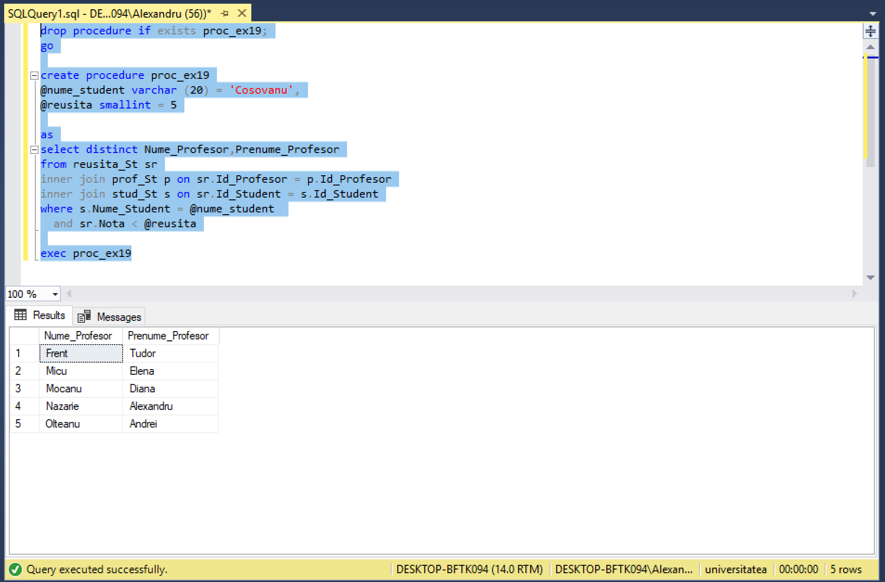
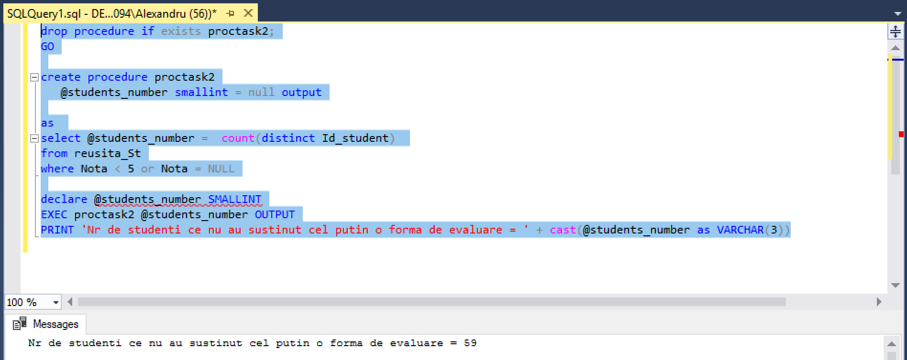
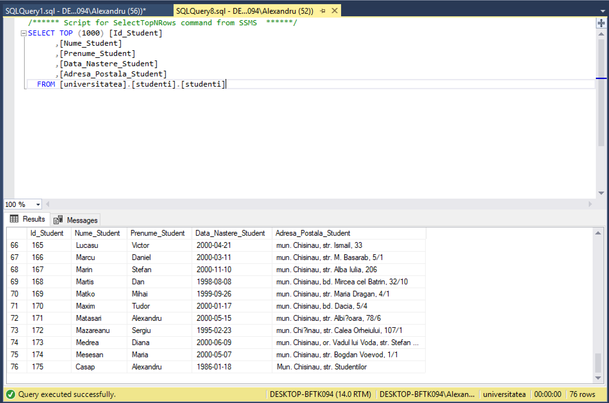
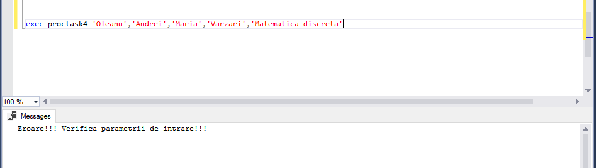
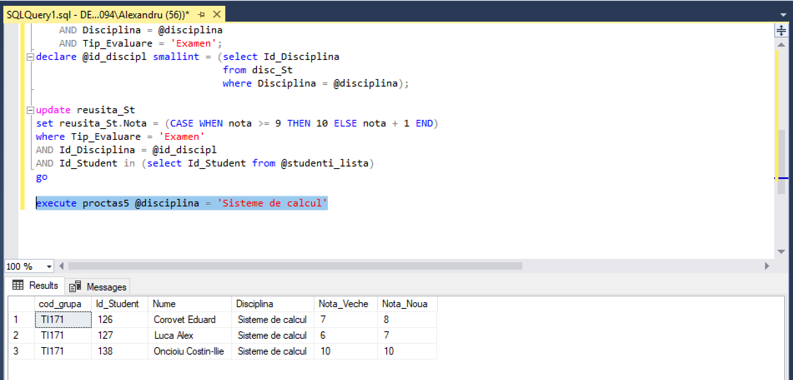

# Laboratorul Nr.9
# Crearea procedurilor stocate si a functiilor definite de utilizator

#TASK_01

Sa se creeze proceduri stocate in baza exercitiilor (2 exercitii) din capitolul 4. Parametrii de intrare trebuie sa corespunda criteriilor din clauzele WHERE ale exercitiilor respective.

```SQL
drop procedure if exists proc_ex19;
go

create procedure proc_ex19
@nume_student varchar (20) = 'Cosovanu',
@reusita smallint = 5

as
select distinct Nume_Profesor,Prenume_Profesor
from reusita_St sr
inner join prof_St p on sr.Id_Profesor = p.Id_Profesor
inner join stud_St s on sr.Id_Student = s.Id_Student
where s.Nume_Student = @nume_student 
  and sr.Nota < @reusita

exec proc_ex19
```



```SQL
drop procedure if exists proc_ex35
go

create procedure proc_ex35
@media_min smallint = 7

as
select d.Disciplina,AVG(cast(sr.Nota as float)) as Media
from reusita_St sr
inner join disc_St d on sr.Id_Disciplina = d.Id_Disciplina
group by d.Disciplina
having AVG(cast(sr.Nota as float)) > @media_min
order by Media

exec proc_ex35
```


#TASK_02

Sa se creeze o procedura stocata, care nu are niciun parametru de intrare si poseda un parametru de iesire. Parametrul de iesire trebuie sa returneze numarul de studenti, care nu au sustinut cel putin o forma de evaluare (nota mai mica de 5 sau valoare NULL).

```SQL
drop procedure if exists proctask2;
GO

create procedure proctask2
   @students_number smallint = null output

as 
select @students_number =  count(distinct Id_student) 
from reusita_St
where Nota < 5 or Nota = NULL

declare @students_number SMALLINT
EXEC proctask2 @students_number OUTPUT
PRINT 'Nr de studenti ce nu au sustinut cel putin o forma de evaluare = ' + cast(@students_number as VARCHAR(3))
```



#TASK_03

Sa se creeze o procedura stocata, care ar insera in baza de date informatii despre un student nou. In calitate de parametri de intrare sa serveasca datele personale ale studentului nou si Cod_Grupa. Sa se genereze toate intrarile-cheie necesare in tabelul studenti_reusita. Notele de evaluare sa fie inserate ca NULL.

```SQL
drop procedure if exists proctask3
go
create procedure proctask3
@nume varchar(50),
@prenume varchar(50),
@data date,
@adresa varchar(200),
@cod_grupa char(6)
as
insert into stud_St
values ((select max(Id_Student)from stud_St) +1, @nume, @prenume, @data, @adresa);
insert into reusita_St
values ((select max(Id_Student)from stud_St), 108, 101 , 
         (select Id_Grupa from grupe where Cod_Grupa = @cod_grupa), 'Examen', NULL, '2018-11-25')
exec proctask3 'Casap','Alexandru','1986-01-18','Mun. Chisinau, str. Studentilor','FAF171'
```



#TASK_03

Fie ca un profesor se elibereaza din functie la mijlocul semestrului. Sa se creeze o procedura stocata care ar reatribui inregistrarile din tabelul studenti_reusita unui alt profesor. Parametri de intrare: numele si prenumele profesorului vechi, numele si prenumele profesorului nou, disciplina. in cazul in care datele inserate sunt incorecte sau incomplete, sa se afiseze un mesaj de avertizare.

```SQL
drop procedure if exists proctask4
go
create procedure proctask4
@nume_prof_vechi VARCHAR(30),
@prenume_prof_vechi VARCHAR(30),
@nume_prof_nou VARCHAR(30),
@prenume_prof_nou VARCHAR(30),
@disciplina VARCHAR(20)

as
if(( select disc_St.Id_Disciplina 
     FROM disc_St 
	 WHERE Disciplina = @disciplina) IN (select distinct reusita_St.Id_Disciplina 
	                                     from reusita_St 
										 where Id_Profesor = (select prof_St.Id_Profesor 
										                      from prof_St 
															  WHERE Nume_Profesor = @nume_prof_vechi 
							                                  AND Prenume_Profesor = @prenume_prof_vechi)))
begin

update reusita_St
set Id_Profesor = (select Id_Profesor
		           from prof_St
		           where Nume_Profesor = @nume_prof_nou
	               AND Prenume_Profesor = @prenume_prof_nou)

where Id_Profesor = (select Id_profesor
		             from prof_St
     		         where Nume_Profesor = @nume_prof_vechi
	                 AND Prenume_Profesor = @prenume_prof_vechi)
end
else
begin
  print 'Eroare!!! Verifica parametrii de intrare!!!'
end


exec proctask4 'Oleanu','Andrei','Maria','Varzari','Matematica discreta'
```




#TASK_05

Sa se creeze o procedura stocata care ar forma o lista cu primii 3 cei mai buni studenti la o disciplina, si acestor studenti sa le fie marita nota la examenul final cu un punct (nota maximala posibila este 10). In calitate de parametru de intrare, va servi denumirea disciplinei. Procedura sa returneze urmatoarele campuri: Cod_Grupa, Nume_Prenume_Student, Disciplina, Nota_ Veche, Nota_Noua.

```SQL
drop procedure if exists proctask5
go
create procedure proctas5
@disciplina VARCHAR(50)

as
declare @studenti_lista table (Id_Student int, Media float)
insert into @studenti_lista
	select top (3) reusita_St.Id_Student, AVG(cast (Nota as float)) as Media
    from reusita_St, disc_St
	where disc_St.Id_Disciplina = reusita_St.Id_Disciplina
	AND Disciplina = @disciplina
	group by reusita_St.Id_Student
	order by Media desc;

select cod_grupa, stud_St.Id_Student, CONCAT(nume_student, ' ', Prenume_Student) as Nume, Disciplina, nota AS Nota_Veche, iif(nota > 9, 10, nota + 1) AS Nota_Noua 
    from reusita_St, disc_St, grupe, stud_St
	where disc_St.id_disciplina = reusita_St.id_disciplina
	AND grupe.Id_Grupa = reusita_St.Id_Grupa
	AND  stud_St.Id_Student = reusita_St.Id_Student
	AND stud_St.Id_Student in (select Id_Student from @studenti_lista)
	AND Disciplina = @disciplina
	AND Tip_Evaluare = 'Examen';
declare @id_discipl smallint = (select Id_Disciplina  
                                from disc_St
                                where Disciplina = @disciplina);

update reusita_St
set reusita_St.Nota = (CASE WHEN nota >= 9 THEN 10 ELSE nota + 1 END)
where Tip_Evaluare = 'Examen'
AND Id_Disciplina = @id_discipl
AND Id_Student in (select Id_Student from @studenti_lista)
go

execute proctas5 @disciplina = 'Sisteme de calcul'
```

