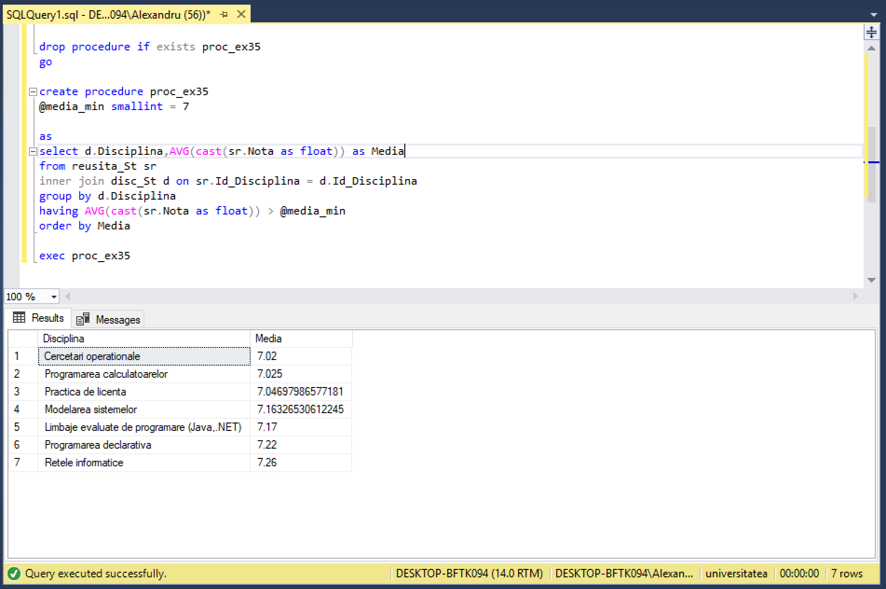

# Laboratorul Nr.9
# Crearea procedurilor stocate si a functiilor definite de utilizator

#TASK_01

Sa se creeze proceduri stocate in baza exercitiilor (2 exercitii) din capitolul 4. Parametrii de intrare trebuie sa corespunda criteriilor din clauzele WHERE ale exercitiilor respective.

```SQL
drop procedure if exists proc_ex19;
go

create procedure proc_ex19
@nume_student varchar (20) = 'Cosovanu',
@reusita smallint = 5

as
select distinct Nume_Profesor,Prenume_Profesor
from reusita_St sr
inner join prof_St p on sr.Id_Profesor = p.Id_Profesor
inner join stud_St s on sr.Id_Student = s.Id_Student
where s.Nume_Student = @nume_student 
  and sr.Nota < @reusita

exec proc_ex19
```


```SQL
drop procedure if exists proc_ex35
go

create procedure proc_ex35
@media_min smallint = 7

as
select d.Disciplina,AVG(cast(sr.Nota as float)) as Media
from reusita_St sr
inner join disc_St d on sr.Id_Disciplina = d.Id_Disciplina
group by d.Disciplina
having AVG(cast(sr.Nota as float)) > @media_min
order by Media

exec proc_ex35
```



#TASK_02

Sa se creeze o procedura stocata, care nu are niciun parametru de intrare si poseda un parametru de iesire. Parametrul de iesire trebuie sa returneze numarul de studenti, care nu au sustinut cel putin o forma de evaluare (nota mai mica de 5 sau valoare NULL).

```SQL
drop procedure if exists proctask2;
GO

create procedure proctask2
   @students_number smallint = null output

as 
select @students_number =  count(distinct Id_student) 
from reusita_St
where Nota < 5 or Nota = NULL

declare @students_number SMALLINT
EXEC proctask2 @students_number OUTPUT
PRINT 'Nr de studenti ce nu au sustinut cel putin o forma de evaluare = ' + cast(@students_number as VARCHAR(3))
```


#TASK_03

Sa se creeze o procedura stocata, care ar insera in baza de date informatii despre un student nou. In calitate de parametri de intrare sa serveasca datele personale ale studentului nou si Cod_Grupa. Sa se genereze toate intrarile-cheie necesare in tabelul studenti_reusita. Notele de evaluare sa fie inserate ca NULL.

```SQL
drop procedure if exists proctask3
go
create procedure proctask3
@nume varchar(50),
@prenume varchar(50),
@data date,
@adresa varchar(200),
@cod_grupa char(6)
as
insert into stud_St
values ((select max(Id_Student)from stud_St) +1, @nume, @prenume, @data, @adresa);
insert into reusita_St
values ((select max(Id_Student)from stud_St), 108, 101 , 
         (select Id_Grupa from grupe where Cod_Grupa = @cod_grupa), 'Examen', NULL, '2018-11-25')
exec proctask3 'Casap','Alexandru','1986-01-18','Mun. Chisinau, str. Studentilor','FAF171'
```

